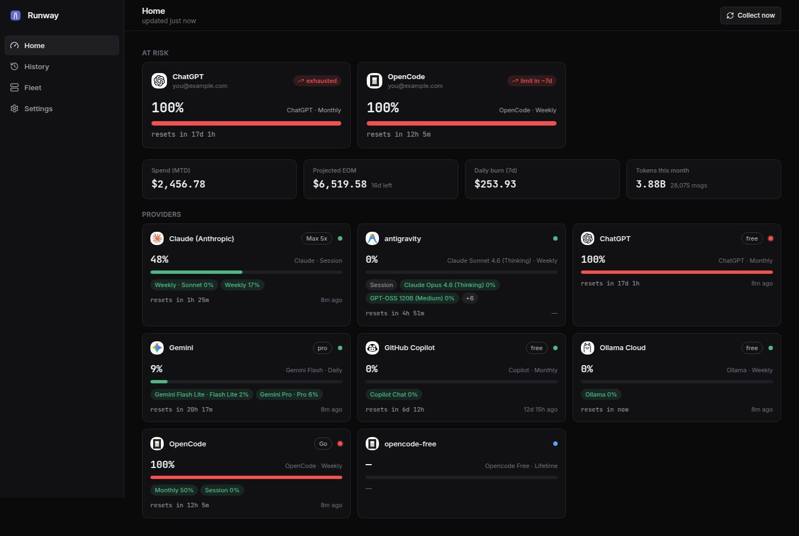
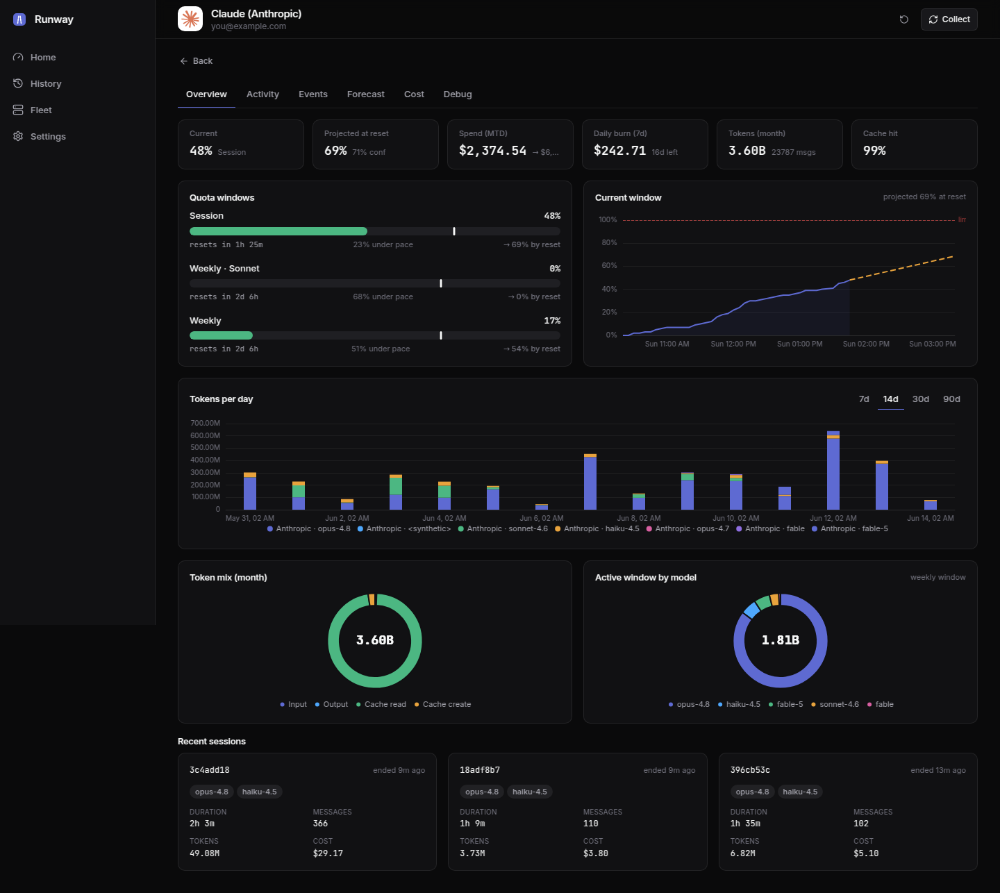
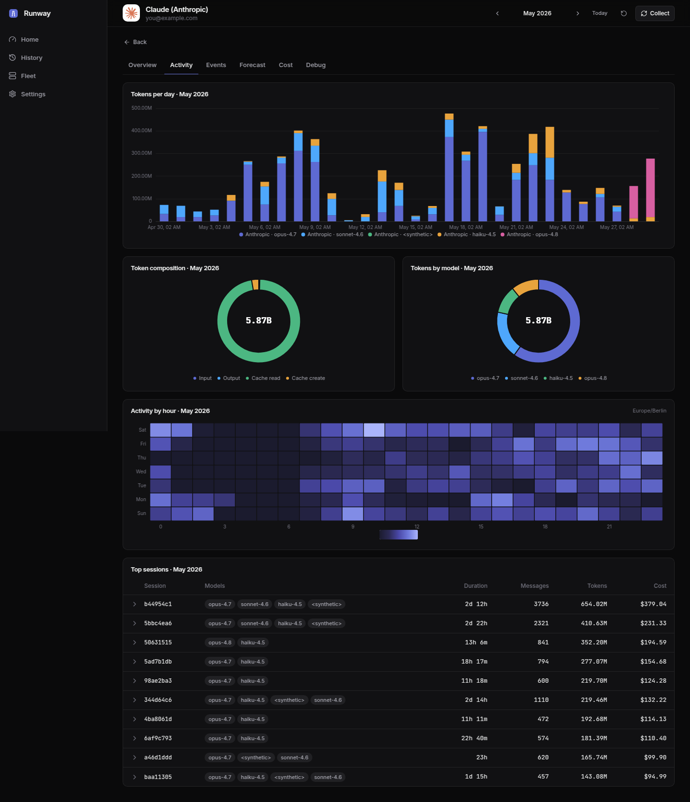
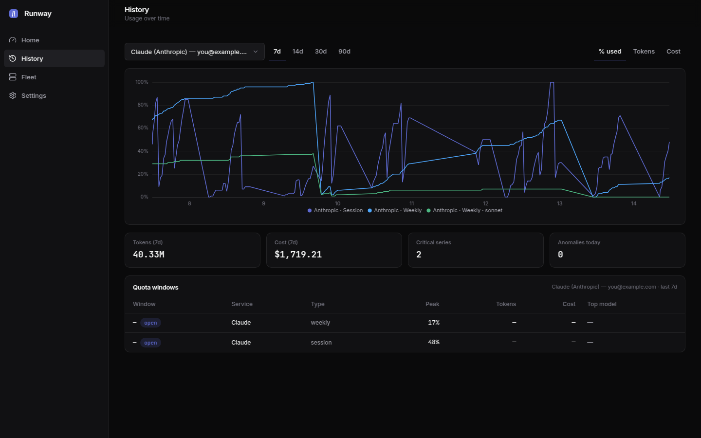
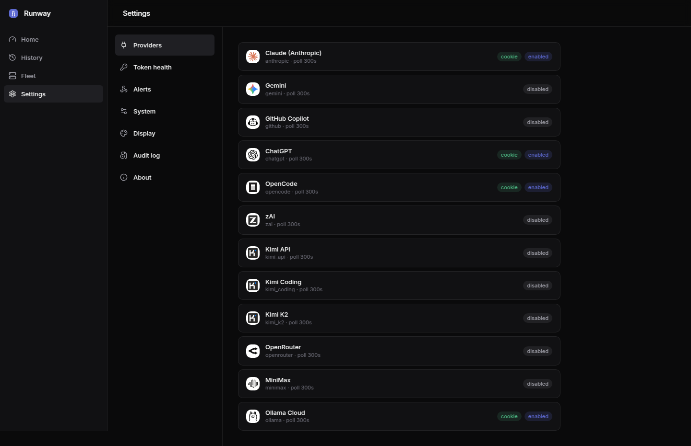
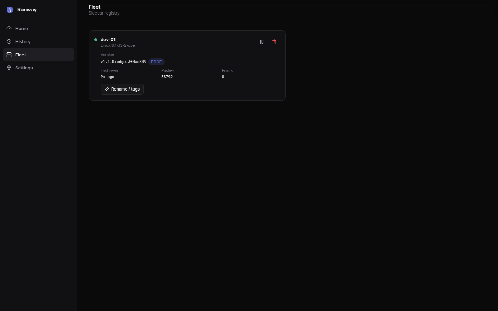

<p align="center">
  
</p>

# Runway — AI Subscription Limits Dashboard

**Runway** is a local-first monitoring tool that tracks remaining capacity and reset timers across your entire generative AI stack — aggregated into a single, clean dashboard with persistent history and fleet management.



<p align="center"><sub>Dark theme shown. Light theme follows your OS preference or Settings → Display.</sub></p>

## Screenshots

<table>
<tr>
<td width="50%"><a href="assets/screenshots/provider.png"></a></td>
<td width="50%"><a href="assets/screenshots/provider-activity.png"></a></td>
</tr>
<tr>
<td align="center"><sub><b>Provider detail page</b> — gauges, current-window forecast, per-model & per-window donuts, recent sessions <br/><a href="assets/screenshots/provider-light.png">(light)</a></sub></td>
<td align="center"><sub><b>Month selector</b> — Activity / Cost / Events scope to any past month (token trend, composition, heatmap, sessions) <br/><a href="assets/screenshots/provider-activity-light.png">(light)</a></sub></td>
</tr>
<tr>
<td width="50%"><a href="assets/screenshots/history.png"></a></td>
<td width="50%"><a href="assets/screenshots/settings.png"></a></td>
</tr>
<tr>
<td align="center"><sub><b>History</b> — % used / tokens / cost across windows with forecast overlay <br/><a href="assets/screenshots/history-light.png">(light)</a></sub></td>
<td align="center"><sub><b>Settings</b> — provider toggles, poll intervals, token health, alerts, audit log, version <br/><a href="assets/screenshots/settings-light.png">(light)</a></sub></td>
</tr>
<tr>
<td width="50%"><a href="assets/screenshots/fleet.png"></a></td>
<td width="50%"></td>
</tr>
<tr>
<td align="center"><sub><b>Fleet</b> — sidecar registry with version, OS, ingest count, pause/resume <br/><a href="assets/screenshots/fleet-light.png">(light)</a></sub></td>
<td></td>
</tr>
</table>

## Key Features

- **13 Collectors, 20+ Data Points**: Monitor Claude, Gemini, GitHub Copilot, OpenRouter, MiniMax, Ollama, and more
- **3-Tier Fallback**: APIs → Web scraping → Local files. If one fails, the next takes over
- **Event-Sourced History**: One immutable row per assistant message in `usage_events` — rollups, windows, and cost are all derived views over the same authoritative log
- **Smart Caching**: Configurable poll interval (default 15 min; per-provider or global override via Settings) plus a smart-sleep mode that stretches to ~2 hours after 45 min of no quota change
- **Instant Serving**: `/limits` returns from an in-memory registry — never blocks on collection
- **Forecast Trajectories**: Theil-Sen regression on quota snapshots projects exhaustion — surfaced on Fleet Commander gauges, the history chart overlay, and the per-provider detail page
- **Persistent History**: SQLite-backed usage snapshots with 15-minute background polling, hourly resolution on ≤7-day windows
- **Provider Detail Page**: A deep-linked per-provider view with Overview, Activity (token trend, composition, heatmap, sessions), Events (per-message stream), Forecast, and Cost tabs
- **Month/Period Selector**: Browse any past month's tokens, spend, and events from the detail page — deep-linkable via `?period=YYYY-MM`, with boundaries on your local timezone
- **Provider Sections**: Dashboard cards grouped by provider with context filter pills (Source / Account / Window)
- **Fleet Management**: Persistent registry of all sidecars with custom names, tags, version reporting, pause/resume controls, and activity tracking
- **Token Health**: Settings panel shows OAuth/cookie expiry status with one-click refresh for supported providers
- **Sidecar Ingestion**: Push metrics and per-message events from external hosts via `POST /api/v1/fleet/ingest` (HMAC-signed, 600/min/IP rate limit)
- **Webhook Alerts**: Per-provider threshold alerts to Discord or Slack
- **Audit Log**: Append-only record of admin mutations, viewable from the Settings panel
- **Build Info**: Settings → About reports the running server version alongside host, encryption, and auth status
- **Display Settings**: Compact mode, 2-column layout, soft chrome — configurable per browser
- **Resilient Rendering**: Individual API failures show "Error Cards" instead of breaking the dashboard
- **Docker Ready**: Headless-first architecture for containerized environments with fail-fast multi-host startup gates (`DB_ENCRYPTION_KEY`, `TLS_TERMINATED`, `CORS_ORIGINS`)

## Quick Start

- **Python 3.12+** and **Node.js 18+** (for UI styling) are required.

```bash
# 1. Clone and setup (installs venv, dependencies, and git hooks)
git clone <repository-url> && cd runway
make install

# 2. Configure (add your API keys)
cp .env.example .env

# 3. Run the full dev stack — server + Vite frontend + local sidecar (Ctrl-C stops all)
make dev-all
```

Access the dev UI at `http://localhost:5173` (Vite hot-reloads the frontend and proxies `/api` to the backend on :8765). Use `make dev` for the server only (no frontend, no cookie/local collectors), or `make run-all` to serve the production-built SPA from the backend at `http://localhost:8765`.

> [!TIP]
> Facing issues with cookie collection or setup? Check the [Troubleshooting Guide](docs/troubleshooting.md).

## Development Shortcuts

Runway includes a `Makefile` to automate common tasks. Run `make help` for the full list.

| Command | Description |
|---------|-------------|
| `make install` | Setup venv, install Python/Node dependencies, and wire up git hooks |
| `make dev` | Start the development server with hot-reload (port 8765) |
| `make dev-all` | Run the full dev stack — server + Vite frontend (:5173) + sidecar (Ctrl-C stops all) |
| `make run` | Start the production server (serves the built SPA at :8765) |
| `make run-all` | Build the SPA, then run the production server + sidecar (no hot reload) |
| `make sidecar` | Run the sidecar agent script |
| `make test` | Run the test suite (standard pytest; automatically ignores macOS-only cookie tests on Linux/WSL) |
| `make test-cov` | Run tests with coverage report (`term-missing`) |
| `make lint` | Run code quality checks (ruff + mypy + pip-audit) |
| `make format` | Automatically fix linting and formatting issues |
| `make web` / `make web-dev` | Build the SPA for production (`webapp/dist`) / run the live Vite dev server on :5173 (HMR) |
| `make secrets` | Scan for secrets against `.secrets.baseline` |
| `make clean` | Remove virtual environments and build artifacts |

### Docker (Server Runtime)

```bash
docker run -p 8765:8765 -e INGEST_API_KEY=secret ghcr.io/s3ntin3l8/runway:latest
```

Prefer Compose? A ready-to-use [`docker-compose.yml`](docker-compose.yml) ships in the repo root — `docker compose up -d` after copying `.env.example` → `.env`. The full Compose example with healthcheck and persistent volume is in the [Deployment Guide](docs/deployment.md#docker).

> [!IMPORTANT]
> **Docker runs the server; cookie/local-file collectors still require a sidecar on each workstation.** Containerized environments have no access to native desktop keychains.
> 1. Collectors requiring browser cookies (Claude, ChatGPT, Ollama, etc.) **must** be configured via Environment Variables or provided via a [sidecar](docs/sidecar.md).
> 2. Use `DB_ENCRYPTION_KEY` to protect sensitive metadata in your persistent volume.

Run [sidecar scripts](docs/sidecar.md) on every host you want to monitor.

### 🔑 Manual Authentication
If you are running in Docker or a headless environment where browser scraping is impossible, you can manually provide authentication tokens in the **Settings** tab.

- **API Key (Bearer Token)**: Paste the full token (usually starts with `eyJ...`). This takes higher priority than cookies.
- **Session Cookie**: Provide as a fallback if explicit tokens are not available.

*Note: For ChatGPT and Claude, we recommend using the Bearer token in the "API Key" field for the most reliable connection.*

### Sidecar binaries (macOS / Windows / Linux)

Pre-built artifacts are attached to every [GitHub release](https://github.com/s3ntin3l8/runway/releases):

- `Runway-Sidecar-macOS-<version>.zip` — desktop tray app
- `Runway-Sidecar-Windows-<version>.zip` — desktop tray app
- `Runway-Sidecar-Linux-<version>.tar.gz` — desktop tray app (needs AppIndicator/GTK + DBus)
- `Runway-Sidecar-Linux-CLI-<version>.tar.gz` — headless single-file binary for servers, Docker, and CI agents (no Python or GUI required)

The desktop binaries are not signed with an Apple Developer ID / Windows code-signing certificate, so the OS's built-in malware gatekeeper will block the first launch.

**macOS** (Gatekeeper: *"Apple could not verify this app is free of malware"*):

```bash
# After unzipping, strip the quarantine attribute:
xattr -cr ~/Downloads/Runway\ Sidecar.app
open ~/Downloads/Runway\ Sidecar.app
```

Alternatively: right-click the app in Finder → **Open** → **Open** again in the dialog. Only required on the first launch.

**Windows** (SmartScreen: *"Windows protected your PC"*): click **More info** → **Run anyway**.

## Supported Providers

**13 providers** — 12 collected by the server, 1 sidecar-only.

| Provider | Collection Method | Cards | Env Var | Docs |
|----------|------------------|-------|---------|------|
| **Claude** | OAuth → Web API → Local logs | 2-5 | `CLAUDE_CODE_OAUTH_TOKEN` (opt) | [📖](docs/collectors/claude.md) |
| **Gemini** | OAuth API + Local logs | 1-7 | `GEMINI_OAUTH_*` (opt) | [📖](docs/collectors/gemini.md) |
| **GitHub Copilot** | REST API | 2 | `GITHUB_TOKEN` | [📖](docs/collectors/github.md) |
| **ChatGPT** | OAuth API → Chrome cookie → Local logs | 1 | `CHATGPT_OAUTH_TOKEN` (opt) | [📖](docs/collectors/chatgpt.md) |
| **OpenRouter** | REST API (Credits) | 1 | `OPENROUTER_API_KEY` | [📖](docs/collectors/openrouter.md) |
| **MiniMax** | REST API (IDE Quotas) | 1-3 | `MINIMAX_API_KEY` | [📖](docs/collectors/minimax.md) |
| **Ollama** | Web API (Cloud) + Session cookie | 2 | `OLLAMA_SESSION_TOKEN` (opt) | [📖](docs/collectors/ollama.md) |
| **OpenCode** | Web API → Local DB → Sidecar | 3 | — (Chrome cookie) | [📖](docs/collectors/opencode.md) |
| **zAI** | REST API (Balance + Quotas) | 1-3 | `ZAI_API_KEY` | [📖 API](docs/collectors/zai_api.md) · [📖 Plan](docs/collectors/zai_plan.md) |
| **Kimi API** | REST API (Balance) | 1 | `KIMI_API_KEY` | [📖](docs/collectors/kimi_api.md) |
| **Kimi Coding** | Web API (IDE Quotas) | 2 | `KIMI_AUTH_TOKEN` (opt) | [📖](docs/collectors/kimi_coding.md) |
| **Kimi K2** | REST API (Credits) | 1 | `KIMI_K2_API_KEY` | [📖](docs/collectors/kimi_k2.md) |

### Sidecar-only providers

These providers can only be collected from the workstation where the IDE/CLI runs, so they require a [sidecar](docs/sidecar.md) on each host. The server container has no path to them.

| Provider | Collection Method | Cards | Env Var | Docs |
|----------|------------------|-------|---------|------|
| **Antigravity** | Local JSON file (sidecar only) | 1-3 | — (IDE running) | [📖](docs/collectors/antigravity.md) |

**Env Var Legend:** (opt) = Optional, has fallback | — = Detected automatically

## Architecture

Runway is always **server + sidecar(s)**. Two orthogonal axes vary: the server can run as Python (`make dev-all` / `make run`) or in Docker, and you can run one sidecar locally or N sidecars across remote hosts. All cookie, IDE, and local-file detection lives in the sidecar; the server handles API/web collection, aggregation, and the dashboard.

👉 **[Full Deployment Guide](docs/deployment.md)** with the per-provider compatibility matrix and Docker Compose examples

## API Reference

All routes are mounted under `/api/v1/`. See **[docs/api-reference.md](docs/api-reference.md)** for the full route inventory (usage, fleet/ingestion, system, auth) and the `LimitCard` response payload schema.

## Optional Security

**`RUNWAY_CONFIG_DIR`** — Override the default platform-specific configuration directory. This controls where Runway stores its database (`runway.db`), external metrics, and OAuth tokens. This is especially useful for Docker deployments or when you need to store configuration in a non-default location.

**`ADMIN_API_KEY`** — When set, the dashboard and admin API endpoints are protected. Unset by default (local-first, single-user). Remote access triggers a Login Screen.

**`DB_ENCRYPTION_KEY`** — Fernet key for encrypting sensitive metadata in SQLite. Unset = plaintext (acceptable for local deployments). Back up this key alongside the database file.

**`TLS_TERMINATED`** — Operator assertion that TLS is terminated upstream (nginx, caddy, cloudflare, kube ingress). **Required** when `APP_HOST` is not localhost — sidecar payloads carry tokens, and HMAC protects integrity but not confidentiality. See [Multi-Host Startup Gates](docs/SECURITY.md#-multi-host-startup-gates).

**`CORS_ORIGINS`** — Comma-separated allow-list of origins for cross-origin requests. **Required** when `APP_HOST` is not localhost.

**`TRUSTED_PROXY_IPS`** — Comma-separated list of reverse-proxy source IPs allowed to assert identity via `X-Forwarded-User` / `Remote-User`. Without an IP allow-list these headers are forgeable and bypass `ADMIN_API_KEY`.

**`LOG_FORMAT`** — `plain` (default) or `json` for structured logging.

**`TZ`** — IANA timezone for dashboard display (e.g. `Europe/Berlin`). Browser auto-detect is used when unset; the Settings panel can override per user.

## Network Access

By default, Runway binds to `127.0.0.1` (local only). To access from other devices on your network:

1. Set `APP_HOST=0.0.0.0` in `.env`
2. Restart Runway
3. Access via `http://<your-ip>:8765`

## Authentication & Security

Runway provides a flexible, multi-layered security model:

- **Local Trust**: When accessing Runway from `127.0.0.1` (localhost), authentication is automated. You will jump straight to the dashboard even if an `ADMIN_API_KEY` is set.
- **Login Screen**: For remote access or Docker deployments, setting `ADMIN_API_KEY` in your `.env` triggers a dedicated **Login Portal**. Enter the key once, and it is persisted in your browser's secure storage.
- **Headless Auth (Proxy)**: If you offload authentication to a reverse proxy (e.g., Authelia, Cloudflare Access, Nginx Auth), Runway will automatically trust and bypass the login screen if `X-Forwarded-User` or `Remote-User` headers are present.

⚠️ **Public Internet**: Never expose Runway directly to the public internet without a reverse proxy (Nginx/Traefik) and HTTPS.

## License

MIT License - see [LICENSE](LICENSE) file.

*Last updated: 2026-06-14*
