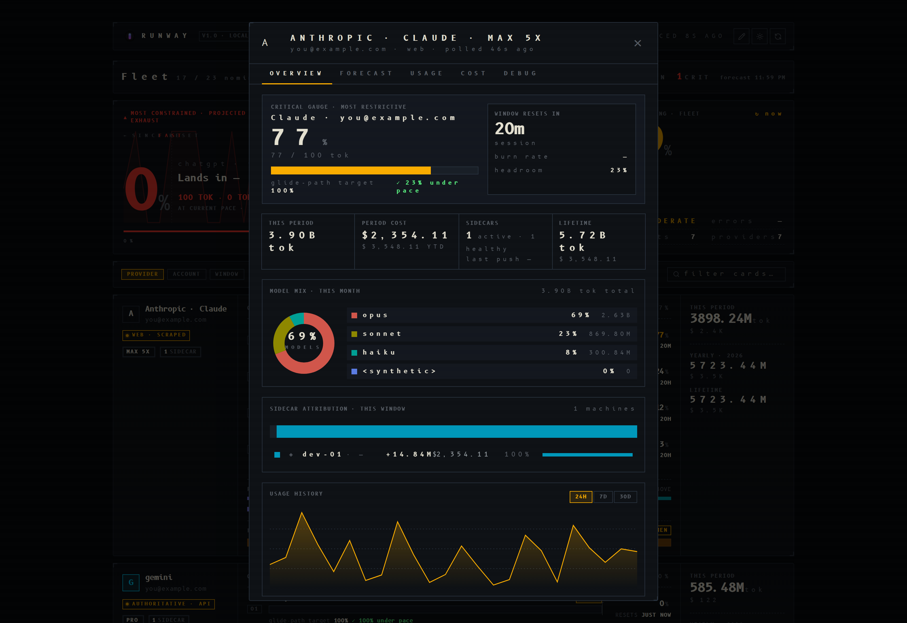

<p align="center">
  
</p>

# Runway — AI Subscription Limits Dashboard

**Runway** is a local-first monitoring tool that tracks remaining capacity and reset timers across your entire generative AI stack — aggregated into a single, high-performance aviation HUD dashboard with persistent history and fleet management.


<p align="center"><sub>Dark "aviation-HUD" theme shown. <a href="assets/screenshots/dashboard-light.png">Light theme</a> is one click away via the sun/moon toggle in the top bar.</sub></p>

## Screenshots

<table>
<tr>
<td width="50%"><a href="assets/screenshots/claude-modal.png"></a></td>
<td width="50%"><a href="assets/screenshots/history.png"></a></td>
</tr>
<tr>
<td align="center"><sub><b>Per-provider modal</b> — gauge, per-model donut, sidecar split, burn history <br/><a href="assets/screenshots/claude-modal-light.png">(light)</a></sub></td>
<td align="center"><sub><b>History</b> — % used / tokens / cost across windows with forecast overlay <br/><a href="assets/screenshots/history-light.png">(light)</a></sub></td>
</tr>
<tr>
<td width="50%"><a href="assets/screenshots/fleet.png"></a></td>
<td width="50%"><a href="assets/screenshots/settings.png"></a></td>
</tr>
<tr>
<td align="center"><sub><b>Fleet</b> — sidecar registry with version, OS, ingest count, pause/resume <br/><a href="assets/screenshots/fleet-light.png">(light)</a></sub></td>
<td align="center"><sub><b>Settings</b> — provider toggles, poll intervals, token health, webhooks, audit log <br/><a href="assets/screenshots/settings-light.png">(light)</a></sub></td>
</tr>
</table>

## Key Features

- **14 Collectors, 20+ Data Points**: Monitor Claude, Gemini, GitHub Copilot, OpenRouter, MiniMax, Ollama, and more
- **3-Tier Fallback**: APIs → Web scraping → Local files. If one fails, the next takes over
- **Event-Sourced History**: One immutable row per assistant message in `usage_events` — rollups, windows, and cost are all derived views over the same authoritative log
- **Smart Caching**: Configurable poll interval (default 15 min; per-provider or global override via Settings) plus a smart-sleep mode that stretches to ~2 hours after 45 min of no quota change
- **Instant Serving**: `/limits` returns from an in-memory registry — never blocks on collection
- **Forecast Trajectories**: Theil-Sen regression on quota snapshots projects exhaustion — surfaced on Fleet Commander gauges, the history chart overlay, and the per-provider modal
- **Persistent History**: SQLite-backed usage snapshots with 15-minute background polling, hourly resolution on ≤7-day windows
- **Provider Sections**: Dashboard cards grouped by provider with context filter pills (Source / Account / Window)
- **Fleet Management**: Persistent registry of all sidecars with custom names, tags, version reporting, pause/resume controls, and activity tracking
- **Token Health**: Settings panel shows OAuth/cookie expiry status with one-click refresh for supported providers
- **Sidecar Ingestion**: Push metrics and per-message events from external hosts via `POST /api/v1/fleet/ingest` (HMAC-signed, 600/min/IP rate limit)
- **Webhook Alerts**: Per-provider threshold alerts to Discord or Slack
- **Audit Log**: Append-only record of admin mutations, viewable from the Settings panel
- **Display Settings**: Compact mode, 2-column layout, soft chrome — configurable per browser
- **Resilient Rendering**: Individual API failures show "Error Cards" instead of breaking the dashboard
- **Docker Ready**: Headless-first architecture for containerized environments with fail-fast multi-host startup gates (`DB_ENCRYPTION_KEY`, `TLS_TERMINATED`, `CORS_ORIGINS`)

## Quick Start

- **Python 3.12+** and **Node.js 18+** (for UI styling) are required.

```bash
# 1. Clone and setup (installs venv, dependencies, and git hooks)
git clone <repository-url> && cd runway
make install

# 2. Configure (add your API keys)
cp .env.example .env

# 3. Run (port 8765)
make dev
```

Access at `http://localhost:8765`

> [!TIP]
> Facing issues with cookie collection or setup? Check the [Troubleshooting Guide](docs/troubleshooting.md).

## Development Shortcuts

Runway includes a `Makefile` to automate common tasks. Run `make help` for the full list.

| Command | Description |
|---------|-------------|
| `make install` | Setup venv, install Python/Node dependencies, and wire up git hooks |
| `make dev` | Start the development server with hot-reload (port 8765) |
| `make dev-all` | Run the dev server and sidecar together (Ctrl-C stops both) |
| `make run` | Start the production server |
| `make sidecar` | Run the standalone sidecar agent script |
| `make test` | Run the test suite (standard pytest; automatically ignores macOS-only cookie tests on Linux/WSL) |
| `make test-cov` | Run tests with coverage report (`term-missing`) |
| `make lint` | Run code quality checks (ruff + mypy + pip-audit) |
| `make format` | Automatically fix linting and formatting issues |
| `make css` / `make watch` | Build Tailwind CSS once / rebuild on change |
| `make secrets` | Scan for secrets against `.secrets.baseline` |
| `make clean` | Remove virtual environments and build artifacts |

### Docker (Headless/Server)

```bash
docker run -p 8765:8765 -e INGEST_API_KEY=secret ghcr.io/s3ntin3l8/ai-usage-tracker:latest
```

> [!IMPORTANT]
> **Docker & Headless Rule**: Containerized environments have no access to native desktop keychains. 
> 1. Collectors requiring browser cookies (Claude, ChatGPT, Ollama, etc.) **must** be configured via Environment Variables or provided via a [sidecar](docs/sidecar.md).
> 2. Use `DB_ENCRYPTION_KEY` to protect sensitive metadata in your persistent volume.

Run [sidecar scripts](docs/sidecar.md) on workstations to send file-based metrics.

### 🔑 Manual Authentication
If you are running in Docker or a headless environment where browser scraping is impossible, you can manually provide authentication tokens in the **Settings** tab.

- **API Key (Bearer Token)**: Paste the full token (usually starts with `eyJ...`). This takes higher priority than cookies.
- **Session Cookie**: Provide as a fallback if explicit tokens are not available.

*Note: For ChatGPT and Claude, we recommend using the Bearer token in the "API Key" field for the most reliable connection.*

### Sidecar binaries (macOS / Windows / Linux)

Pre-built artifacts are attached to every [GitHub release](https://github.com/s3ntin3l8/ai-usage-tracker/releases):

- `Runway-Sidecar-macOS-<version>.zip` — desktop tray app
- `Runway-Sidecar-Windows-<version>.zip` — desktop tray app
- `Runway-Sidecar-Linux-<version>.tar.gz` — desktop tray app (needs AppIndicator/GTK + DBus)
- `Runway-Sidecar-Linux-CLI-<version>.tar.gz` — headless single-file binary for servers, Docker, and CI agents (no Python or GUI required)

The desktop binaries are not signed with an Apple Developer ID / Windows code-signing certificate, so the OS's built-in malware gatekeeper will block the first launch.

**macOS** (Gatekeeper: *"Apple could not verify this app is free of malware"*):

```bash
# After unzipping, strip the quarantine attribute:
xattr -cr ~/Downloads/Runway\ Sidecar.app
open ~/Downloads/Runway\ Sidecar.app
```

Alternatively: right-click the app in Finder → **Open** → **Open** again in the dialog. Only required on the first launch.

**Windows** (SmartScreen: *"Windows protected your PC"*): click **More info** → **Run anyway**.

## Supported Providers

| Provider | Collection Method | Cards | Env Var | Docs |
|----------|------------------|-------|---------|------|
| **Claude** | OAuth → Web API → Local logs | 2-5 | `CLAUDE_CODE_OAUTH_TOKEN` (opt) | [📖](docs/collectors/claude.md) |
| **Gemini** | OAuth API + Local logs | 1-7 | `GEMINI_OAUTH_*` (opt) | [📖](docs/collectors/gemini.md) |
| **GitHub Copilot** | REST API | 2 | `GITHUB_TOKEN` | [📖](docs/collectors/github.md) |
| **ChatGPT** | OAuth API → Chrome cookie → Local logs | 1 | `CHATGPT_OAUTH_TOKEN` (opt) | [📖](docs/collectors/chatgpt.md) |
| **OpenRouter** | REST API (Credits) | 1 | `OPENROUTER_API_KEY` | [📖](docs/collectors/openrouter.md) |
| **MiniMax** | REST API (IDE Quotas) | 1-3 | `MINIMAX_API_KEY` | [📖](docs/collectors/minimax.md) |
| **Ollama** | Web API (Cloud) + Session cookie | 2 | `OLLAMA_SESSION_TOKEN` (opt) | [📖](docs/collectors/ollama.md) |
| **OpenCode** | Web API → Local DB → Sidecar | 3 | — (Chrome cookie) | [📖](docs/collectors/opencode.md) |
| **zAI API** | REST API (Balance) | 1 | `ZAI_API_KEY` | [📖](docs/collectors/zai_api.md) |
| **zAI Plan** | REST API (Quotas) | 1-2 | `ZAI_API_KEY` | [📖](docs/collectors/zai_plan.md) |
| **Kimi API** | REST API (Balance) | 1 | `KIMI_API_KEY` | [📖](docs/collectors/kimi_api.md) |
| **Kimi Coding** | Web API (IDE Quotas) | 2 | `KIMI_AUTH_TOKEN` (opt) | [📖](docs/collectors/kimi_coding.md) |
| **Kimi K2** | REST API (Credits) | 1 | `KIMI_K2_API_KEY` | [📖](docs/collectors/kimi_k2.md) |
| **Antigravity** | Local JSON file | 1-3 | — (IDE running) | [📖](docs/collectors/antigravity.md) |

**Env Var Legend:** (opt) = Optional, has fallback | — = Detected automatically

## Architecture

Runway follows a **Service-Collector Pattern** with three deployment modes: **Standalone** (single machine), **Multi-Host** (main + sidecars), and **Docker** (sidecars only).

👉 **[Full Deployment Guide](docs/deployment-modes.md)** with mode compatibility matrix and Docker Compose examples

## API Reference

All API routes are under `/api/v1/`.

### Usage & history

| Method | Route | Description |
|--------|-------|-------------|
| `GET` | `/api/v1/usage/limits` | All current quota cards (instant, from in-memory registry) |
| `GET` | `/api/v1/usage/fleet` | Fleet HUD: critical gauge + secondary limits per (provider, account), with `window_aggregations.longest` per-model/per-sidecar splits |
| `GET` | `/api/v1/usage/cumulative` | Authorized totals across sidecars (lifetime/year/month/day) |
| `GET` | `/api/v1/usage/forecast` | Theil-Sen projection to reset; `include_series=true` returns drill-down points |
| `GET` | `/api/v1/usage/history/windows` | Paginated closed quota windows |
| `GET` | `/api/v1/usage/history/snapshots` | Paginated snapshot rows with per-series delta |
| `GET` | `/api/v1/usage/history/chart` | Time-series data for percent/tokens/cost visualisations |
| `GET` | `/api/v1/usage/history/window-detail` | Fill-up series + by-model breakdown for one window |
| `GET` | `/api/v1/usage/history/deltas` | Event-sourced consumption deltas |
| `GET` | `/api/v1/usage/events` | Recent event tail for (provider, account) |
| `GET` | `/api/v1/usage/window-history` | Closed-window history with per-model & per-sidecar splits |
| `GET` | `/api/v1/usage/heatmap` | 7×24 hour-of-day activity grid |
| `GET` | `/api/v1/usage/sessions` | Top-N sessions (`sort_by=tokens` or `recent`) |
| `GET` | `/api/v1/usage/cost-forecast` | MTD cost + 7-day burn extrapolated to EOM |
| `GET` | `/api/v1/usage/anomalies` | Z-score spike detection vs. historical mean |
| `POST` | `/api/v1/usage/reset/{provider}` | Clear terminal failure state for a provider |
| `POST` | `/api/v1/usage/collect/{provider}` | Force immediate re-collection for one provider |

### Fleet / Ingestion

| Method | Route | Description |
|--------|-------|-------------|
| `POST` | `/api/v1/fleet/ingest` | Push metrics + events from a sidecar (HMAC-SHA256 signed, 600/min/IP) |
| `GET` | `/api/v1/fleet/sidecars` | List all registered sidecars |
| `GET` | `/api/v1/fleet/sidecars/{id}` | Single sidecar details |
| `PATCH` | `/api/v1/fleet/sidecars/{id}` | Update custom name or tags (admin) |
| `DELETE` | `/api/v1/fleet/sidecars/{id}` | Remove sidecar from registry (admin) |
| `POST` | `/api/v1/fleet/sidecars/{id}/pause` | Pause collection on a sidecar (admin) |
| `POST` | `/api/v1/fleet/sidecars/{id}/resume` | Resume collection on a sidecar (admin) |
| `GET` | `/api/v1/fleet/config` | Active collection config the sidecar should poll |

### System

| Method | Route | Description |
|--------|-------|-------------|
| `GET` | `/api/v1/system/health` | Liveness check |
| `GET` | `/api/v1/system/status` | Collector cache states and error counts |
| `GET` | `/api/v1/system/settings` | Non-sensitive runtime configuration |
| `GET` | `/api/v1/system/audit-log` | Append-only admin-mutation trail |
| `GET` | `/api/v1/system/token-health` | OAuth/cookie expiry status for all credentials |
| `POST` | `/api/v1/system/token-health/refresh/{provider}/{account_id}` | Trigger OAuth token refresh (admin) |
| `DELETE` | `/api/v1/system/token-health/{provider}/{account_id}` | Evict token from cache (admin) |
| `POST` | `/api/v1/system/force-collect` | Trigger immediate collection cycle, fan out to sidecars |
| `POST` | `/api/v1/system/cleanup` | Prune stale records and inactive sidecars (admin) |
| `POST` | `/api/v1/system/wake` | Reset dormancy, restore normal polling |
| `GET` | `/api/v1/system/debug/raw/{provider_id}` | Run collector and return raw HTTP responses (debug) |
| `GET`/`POST`/`PATCH`/`DELETE` | `/api/v1/system/webhooks[...]` | CRUD + test for Discord/Slack threshold alerts (admin) |
| `GET`/`PUT` | `/api/v1/system/provider-config[s]/{...}` | Per-provider config CRUD (admin write) |
| `GET`/`PUT` | `/api/v1/system/app-config` | Global app config (admin write) |
| `GET`/`PUT` | `/api/v1/system/dashboard-layout` | Persisted dashboard layout |

### Auth (GitHub Device Flow)

| Method | Route | Description |
|--------|-------|-------------|
| `GET` | `/api/v1/auth/github/init` | Begin GitHub OAuth Device Flow |
| `POST` | `/api/v1/auth/github/poll` | Poll for completion |
| `GET` | `/api/v1/auth/github/status` | Current GitHub auth state |
| `POST` | `/api/v1/auth/github/logout` | Discard stored GitHub token |

**Desktop App (macOS & Windows):** Download the pre-built sidecar binary from the [releases page](https://github.com/bjoernf73/runway/releases/latest).

See [Sidecar Documentation](docs/sidecar.md) for ingest authentication and payload format.

### LimitCard Schema

```typescript
interface LimitCard {
  // Core display fields
  service_name: string;     // Provider name (e.g., "Claude Pro")
  icon: string;             // Unicode emoji
  remaining: string;        // Remaining quota (e.g., "85%", "$12.50")
  unit: string;             // Unit description (e.g., "tokens", "/ 100")
  reset: string;            // Human-readable reset (e.g., "in 4h 23m")
  health: string;           // "good" | "warning" | "critical"
  pace: string;             // "Stable" | "Moderate Burn" | "Fast Burn"
  detail: string;           // Additional context

  // Identity & routing
  provider_id?: string;     // Platform key (e.g., "anthropic", "gemini")
  account_id?: string;      // Unique account hash/ID
  account_label?: string;   // Human-readable identity (email, org)
  sidecar_id?: string;      // Originating host; null = local collection
  model_id?: string;        // Specific model; null = aggregate snapshot

  // Usage data
  used_value?: number;      // Raw used amount
  limit_value?: number;     // Raw limit amount
  is_unlimited?: boolean;
  unit_type?: string;       // "currency" | "tokens" | "requests" | "percent"
  currency?: string;      // "USD" | "EUR" | "CNY"
  window_type?: string;    // "daily" | "weekly" | "monthly" | "session" | "rolling" | "unknown"

  // Token breakdown (when available)
  token_usage?: {          // Token count breakdown
    input: number;        // Input tokens
    output: number;       // Output tokens
    reasoning?: number;    // Reasoning tokens (if available)
    cache_read?: number;    // Cache read tokens (if available)
    total: number;       // Total tokens
  };
  by_model?: Record<string, {  // Per-model breakdown
    cost: number;           // Cost for this model
    msgs: number;           // Messages from this model
    tokens?: number;        // Tokens for this model (if available)
  }>;
  msgs?: number;            // Total message count
  pct_used?: number;      // Percentage used based on cost

  // Metadata
  reset_at?: string;      // ISO 8601 timestamp for tooltip
  data_source?: string;   // "api" | "web" | "local" (origin of payload)
  input_source?: string;  // "config" | "server" | "sidecar" (origin of credentials)
  variant?: string;       // Disambiguates multiple windows of the same type (e.g. "sonnet" vs "opus" weekly)
  error_type?: string;    // Populated when collection fails — surfaces as an Error Card
  tier?: string;          // "Free" | "Pro" | "Enterprise"
  usage_url?: string;     // Link to provider usage page
  updated_at?: string;    // ISO 8601 timestamp
  metadata?: Record<string, unknown>;  // Free-form, provider-specific extras
}
```

See `app/models/schemas.py` for the authoritative Pydantic definition. Token breakdown semantics, the `data_source`/`input_source` taxonomy, and the event-sourced data model are documented in [CLAUDE.md](CLAUDE.md) and [docs/statistics.md](docs/statistics.md).

## Optional Security

**`RUNWAY_CONFIG_DIR`** — Override the default platform-specific configuration directory. This controls where Runway stores its database (`runway.db`), external metrics, and OAuth tokens. This is especially useful for Docker deployments or when you need to store configuration in a non-default location.

**`ADMIN_API_KEY`** — When set, the dashboard and admin API endpoints are protected. Unset by default (local-first, single-user). Remote access triggers a Login Screen.

**`DB_ENCRYPTION_KEY`** — Fernet key for encrypting sensitive metadata in SQLite. Unset = plaintext (acceptable for local deployments). Back up this key alongside the database file.

**`TLS_TERMINATED`** — Operator assertion that TLS is terminated upstream (nginx, caddy, cloudflare, kube ingress). **Required** when `APP_HOST` is not localhost — sidecar payloads carry tokens, and HMAC protects integrity but not confidentiality. See [Multi-Host Startup Gates](docs/SECURITY.md#-multi-host-startup-gates).

**`CORS_ORIGINS`** — Comma-separated allow-list of origins for cross-origin requests. **Required** when `APP_HOST` is not localhost.

**`TRUSTED_PROXY_IPS`** — Comma-separated list of reverse-proxy source IPs allowed to assert identity via `X-Forwarded-User` / `Remote-User`. Without an IP allow-list these headers are forgeable and bypass `ADMIN_API_KEY`.

**`LOG_FORMAT`** — `plain` (default) or `json` for structured logging.

**`TZ`** — IANA timezone for dashboard display (e.g. `Europe/Berlin`). Browser auto-detect is used when unset; the Settings panel can override per user.

## Network Access

By default, Runway binds to `127.0.0.1` (local only). To access from other devices on your network:

1. Set `APP_HOST=0.0.0.0` in `.env`
2. Restart Runway
3. Access via `http://<your-ip>:8765`

## Authentication & Security

Runway provides a flexible, multi-layered security model:

- **Local Trust**: When accessing Runway from `127.0.0.1` (localhost), authentication is automated. You will jump straight to the dashboard even if an `ADMIN_API_KEY` is set.
- **Login Screen**: For remote access or Docker deployments, setting `ADMIN_API_KEY` in your `.env` triggers a dedicated **Login Portal**. Enter the key once, and it is persisted in your browser's secure storage.
- **Headless Auth (Proxy)**: If you offload authentication to a reverse proxy (e.g., Authelia, Cloudflare Access, Nginx Auth), Runway will automatically trust and bypass the login screen if `X-Forwarded-User` or `Remote-User` headers are present.

⚠️ **Public Internet**: Never expose Runway directly to the public internet without a reverse proxy (Nginx/Traefik) and HTTPS.

## License

MIT License - see [LICENSE](LICENSE) file.

*Last updated: 2026-05-21*
