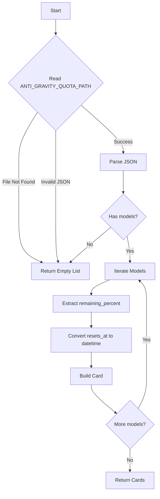

# Antigravity Collector

**File:** `app/services/collectors/antigravity.py`

File-based quota collector for the Antigravity IDE, reading from a local JSON file updated by the IDE.

---

## Overview

The Antigravity collector retrieves quota information from a local JSON file written by the Antigravity IDE. Unlike API-based collectors, this uses a passive file-watching approach where the IDE periodically exports its quota state.

### Key Features

- **File-Based Collection**: Reads from local JSON file (no API calls)
- **Multi-Model Support**: Returns one card per model with individual quota status
- **Silent Failure**: Returns empty list if file missing (assumes IDE not configured)
- **Percentage-Based**: Shows remaining percentage (0-100%)
- **Timestamp Parsing**: Converts Unix timestamps to human-readable reset times

---

## Data Sources

### Primary: Local JSON Quota File

**Location:** Configurable via `ANTIGRAVITY_QUOTA_PATH`

**Default:** `~/.antigravity/quota.json`

**Format:**
```json
{
  "models": {
    "claude-sonnet-4": {
      "remaining_percent": 75.5,
      "resets_at": 1775570736
    },
    "claude-opus-4": {
      "remaining_percent": 92.0,
      "resets_at": 1775570736
    }
  }
}
```

**Field Mapping:**

| JSON Field | Type | Description |
|------------|------|-------------|
| `models` | Object | Dictionary of model names to quota data |
| `{model}.remaining_percent` | Float | Percentage remaining (0-100) |
| `{model}.resets_at` | Integer | Unix timestamp (seconds) for quota reset |

**File Update Frequency:**
- Updated when user checks quota in IDE
- Updated at IDE startup
- May be updated periodically during usage

---

## Collection Flow



---

## Output Format

### Standard Card

```python
{
    "service": "AG: claude-sonnet-4",
    "icon": "🛸",
    "remaining": "75.5%",           # Percentage remaining
    "unit": "remaining",
    "reset": "in 2h 15m",           # Human-readable delta
    "health": "good",               # > 30% remaining
    "pace": "Stable",               # Based on burn rate
    "detail": "claude-sonnet-4 [IDE]"
}
```

**Service Name Prefix:**
- All services prefixed with "AG: " for visual identification
- Example: `AG: claude-sonnet-4`

---

## Health Calculation

Based on **remaining percentage**:

```python
if remaining_percent > 30:
    health = "good"      # Green
else:
    health = "warning"   # Yellow
```

**Note:** No "critical" threshold defined - Antigravity quotas are typically generous.

---

## Pace Calculation

Uses `PaceCalculator.estimate_longevity()` with:
- **Current usage:** `100 - remaining_percent` (% used)
- **Reset time:** Parsed from `resets_at` timestamp

| Usage | Pace | Meaning |
|-------|------|---------|
| < 50% used | "Stable" | Normal consumption |
| 50-80% used | "Moderate Burn" | Elevated usage |
| > 80% used | "Fast Burn" | Approaching limit |

---

## Configuration

### Environment Variables

| Variable | Default | Description |
|----------|---------|-------------|
| `ANTIGRAVITY_QUOTA_PATH` | `~/.antigravity/quota.json` | Path to quota JSON file |

### File Permissions

The collector requires read access to the quota file:
```bash
# Ensure file exists and is readable
ls -la ~/.antigravity/quota.json

# If needed, fix permissions
chmod 644 ~/.antigravity/quota.json
```

---

## Error Handling

All errors result in **silent failure** (returns empty list):

| Scenario | Behavior |
|----------|----------|
| File not found | Return `[]` (IDE not configured) |
| Permission denied | Return `[]` |
| Invalid JSON | Return `[]` |
| Missing `models` key | Return `[]` |
| Empty `models` object | Return `[]` |
| Missing `remaining_percent` | Defaults to `0.0` |
| Missing `resets_at` | Shows "Unknown" reset time |

**Design Philosophy:** Antigravity is an optional IDE. Its absence should not affect the dashboard.

---

## Troubleshooting

### Issue: No Antigravity cards in dashboard

**Diagnosis Steps:**

1. **Check file exists:**
   ```bash
   ls -la ~/.antigravity/quota.json
   ```

2. **Check environment variable:**
   ```bash
   echo $ANTIGRAVITY_QUOTA_PATH
   ```

3. **Verify JSON format:**
   ```bash
   cat ~/.antigravity/quota.json | python3 -m json.tool
   ```

**Causes:**
- Antigravity IDE not installed
- IDE hasn't written quota file yet (check quota in IDE first)
- Wrong file path configured
- File permissions issue

### Issue: Shows 0% remaining for all models

**Cause:** `remaining_percent` field missing or zero

**Fix:** Check IDE quota display and trigger a refresh

### Issue: Reset time shows "Unknown"

**Cause:** `resets_at` timestamp missing

**Expected:** Some models may not have reset timestamps (one-time quotas)

---

## Comparison: File-Based vs API Collectors

| Aspect | Antigravity (File) | API Collectors |
|--------|-------------------|----------------|
| **Requires** | Local file access | API credentials |
| **Network** | None (offline) | HTTP requests |
| **Latency** | Instant | Variable (API dependent) |
| **Freshness** | IDE-dependent | Real-time |
| **Reliability** | High (local file) | Medium (network dependent) |
| **Deployment** | Requires IDE on host | Works remotely |

---

## Future Options

### Potential: File Watching

**Current:** Reads file on each collection cycle

**Future:** Use `watchdog` or `inotify` to watch for file changes:
```python
from watchdog.observers import Observer
from watchdog.events import FileSystemEventHandler

class QuotaFileHandler(FileSystemEventHandler):
    def on_modified(self, event):
        if event.src_path == quota_path:
            reload_quota()
```

**Benefits:** Instant updates when IDE writes new data
**Trade-off:** Adds dependency, more complex

**Priority:** Low (polling is sufficient)

### Potential: API Fallback

**Current:** File-only collection

**Future:** If Antigravity exposes an API:
```python
# Pseudo-code
async def collect(self, client):
    # Try file first
    if file_exists():
        return read_file()
    # Fallback to API
    return await call_antigravity_api(client)
```

**Priority:** Low (file-based works well for local IDE)

### Potential: Sidecar Support

**Current:** Requires local file access

**Future:** Sidecar could forward file contents:
```python
# Sidecar reads file and sends to main app
{"provider": "antigravity", "quota_file": {...}}
```

**Use Case:** Docker deployments where file isn't accessible

**Priority:** Medium (enables containerized deployments)

### Future Investigation: LSP Protocol Approach

**Reference:** [CodexBar Antigravity Implementation](https://github.com/steipete/CodexBar/blob/main/docs/antigravity.md)

CodexBar uses an active LSP protocol approach instead of passive file reading. This could be implemented as a fallback or replacement for the file-based method.

**Process Overview:**

1. **Process Detection**
   - Command: `ps -ax -o pid=,command=`
   - Match: `language_server_macos` with Antigravity markers (`--app_data_dir antigravity`)
   - Extract: `--csrf_token` and `--extension_server_port` from CLI flags

2. **Port Discovery**
   - Command: `lsof -nP -iTCP -sTCP:LISTEN -p <pid>`
   - Probe all listening ports with HTTPS POST to `/GetUnleashData`

3. **API Communication**
   - Endpoint: `POST https://127.0.0.1:<port>/exa.language_server_pb.LanguageServerService/GetUserStatus`
   - Headers:
     - `X-Codeium-Csrf-Token: <token>`
     - `Connect-Protocol-Version: 1`
   - Fallback: `GetCommandModelConfigs` endpoint

4. **Field Mapping**
   - Source: `userStatus.cascadeModelConfigData.clientModelConfigs[].quotaInfo`
   - Fields:
     - `remainingFraction` → percentage remaining
     - `resetTime` → ISO-8601 timestamp
   - Model priority: Claude → Gemini Pro Low → Gemini Flash → Fallback

**Comparison:**

| Aspect | File-Based (Current) | LSP Protocol (Future) |
|--------|---------------------|----------------------|
| **Requires** | File write permission | Process access + port scanning |
| **Reliability** | Dependent on IDE writing file | Real-time, always current |
| **Complexity** | Low | High (process detection, HTTPS with self-signed certs) |
| **Cross-platform** | Universal | Requires platform-specific process handling |
| **Speed** | Instant | Slower (process scan + HTTP calls) |

**Decision:** Keep file-based approach as primary. LSP protocol could be added as:
- Fallback when file is stale/missing
- Optional "live mode" for real-time updates
- Sidecar implementation for remote monitoring

**Priority:** Low-Medium (file-based works well for current needs)

---

## Related Files

| File | Purpose |
|------|---------|
| `app/services/collectors/antigravity.py` | Main collector implementation |
| `app/core/config.py` | Path configuration |
| `app/core/utils.py` | `PaceCalculator`, `human_delta` helpers |
| `tests/unit/test_collectors.py` | Unit tests |

---

## References

- **Antigravity IDE:** https://antigravity.ai (or official documentation)
- **JSON Format:** Based on IDE's quota export feature
- **Similar Pattern:** OpenCode collector also uses file-based approach

---

*Last updated: 2026-04-07*
