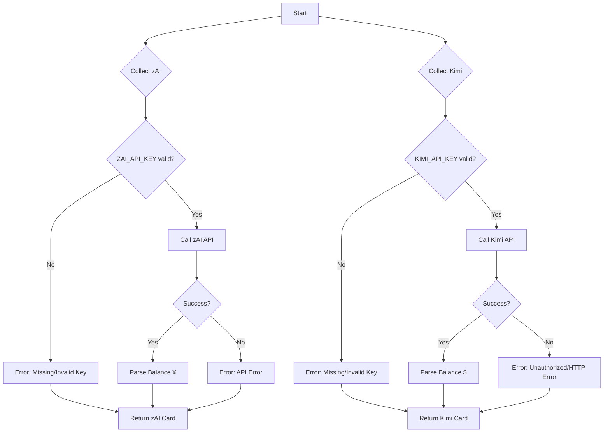

# Chinese AI Collector

**File:** `app/services/collectors/chinese_ai.py`

Dual-provider collector for Chinese AI services: zAI (Zhipu AI/GLM) and Kimi K2.5 (Moonshot AI).

---

## Overview

The Chinese AI collector retrieves prepaid account balances from two popular Chinese AI providers. Both providers use a prepaid credit model rather than quota-based limits, returning monetary balance instead of token counts.

### Key Features

- **Dual Provider Support**: Independently queries zAI and Kimi APIs
- **Prepaid Balance Model**: Shows account balance (¥/$) rather than usage quotas
- **Parallel Error Handling**: Each provider fails independently without affecting the other
- **Key Validation**: Validates API keys before making requests
- **Currency Display**: zAI in Chinese Yuan (¥), Kimi in USD ($)

---

## Data Sources

### 1. zAI (GLM - Zhipu AI)

**Endpoint:** `https://open.bigmodel.cn/api/paas/v4/users/me/balance`

**Authentication:** Bearer token via `ZAI_API_KEY` environment variable

**Key Validation:**
- Checks key is not literally "zai" (placeholder detection)
- Returns error card if key missing or invalid

**Response Format:**
```json
{
  "data": {
    "available_balance": "125.50"
  }
}
```

**Model:** Prepaid credits in Chinese Yuan (¥)

---

### 2. Kimi K2.5 (Moonshot AI)

**Endpoint:** `https://api.moonshot.cn/v1/users/me/balance`

**Authentication:** Bearer token via `KIMI_API_KEY` environment variable

**Key Validation:**
- Checks key length >= 10 (minimum valid key length)
- Returns error card if key missing or too short

**Response Format:**
```json
{
  "data": {
    "available_balance": "45.75"
  }
}
```

**Model:** Prepaid credits in USD ($)

---

## Collection Flow



---

## Output Format

### zAI (GLM) Card

```python
{
    "service": "zAI (GLM)",
    "icon": "🌐",
    "remaining": "¥125.50",      # Available balance
    "unit": "balance",
    "reset": "Manual",           # Prepaid - no reset
    "health": "good",            # > ¥10 = good
    "pace": "Stable",
    "detail": "Prepaid balance"
}
```

### Kimi K2.5 Card

```python
{
    "service": "Kimi K2.5",
    "icon": "🌙",
    "remaining": "$45.75",       # Available balance
    "unit": "balance",
    "reset": "Manual",           # Prepaid - no reset
    "health": "good",            # > $5 = good
    "pace": "Stable",
    "detail": "Prepaid balance"
}
```

### Error Cards

| Provider | Scenario | Error Message |
|----------|----------|---------------|
| zAI | Missing/placeholder key | `Missing/Invalid Key` |
| zAI | API error (non-200) | `API Error` |
| zAI | Connection failure | `Connection Failed` |
| Kimi | Missing/short key | `Missing/Invalid Key` |
| Kimi | 401 Unauthorized | `Unauthorized` |
| Kimi | Other HTTP error | `HTTP {status_code}` |
| Kimi | Connection failure | `Connection Failed` |

---

## Health Calculation

Based on **account balance** (not usage):

### zAI (GLM)

```python
if balance > 10:
    health = "good"      # Green
else:
    health = "warning"   # Yellow (low balance)
```

**Threshold:** ¥10 (~$1.40 USD)

### Kimi K2.5

```python
if balance > 5:
    health = "good"      # Green
else:
    health = "warning"   # Yellow (low balance)
```

**Threshold:** $5 USD

**Note:** No "critical" threshold - both providers simply stop working when balance reaches zero.

---

## Configuration

### Environment Variables

| Variable | Required | Description | Example |
|----------|----------|-------------|---------|
| `ZAI_API_KEY` | For zAI | Zhipu AI API key | `sk-abc123...` |
| `KIMI_API_KEY` | For Kimi | Moonshot API key | `sk-proj-xyz789...` |

### Getting API Keys

**zAI (Zhipu AI):**
1. Sign up at https://open.bigmodel.cn/
2. Go to "API Keys" section
3. Generate a new key

**Kimi (Moonshot AI):**
1. Sign up at https://platform.moonshot.cn/
2. Navigate to "API Keys"
3. Create a new key (format: `sk-proj-...`)

---

## Comparison: Prepaid vs Quota Models

| Aspect | Chinese AI (Prepaid) | Western AI (Quota) |
|--------|----------------------|-------------------|
| **Metric** | Account balance (¥/$) | Token/request quotas |
| **Reset** | Manual (add credits) | Automatic (time-based) |
| **Health** | Based on remaining $ | Based on % used |
| **Overage** | Stops working | May have extra usage |
| **Display** | "¥125.50 balance" | "75% remaining" |

---

## Troubleshooting

### Issue: Both providers show "Missing/Invalid Key"

**Cause:** Environment variables not set

**Fix:**
```bash
export ZAI_API_KEY="your-zai-key-here"
export KIMI_API_KEY="your-kimi-key-here"
```

### Issue: zAI shows "API Error"

**Causes:**
- Invalid API key format
- Account suspended
- API endpoint changed

**Check:**
```bash
curl -H "Authorization: Bearer $ZAI_API_KEY" \
  https://open.bigmodel.cn/api/paas/v4/users/me/balance
```

### Issue: Kimi shows "Unauthorized"

**Cause:** Invalid or expired API key

**Fix:** Regenerate key at https://platform.moonshot.cn/

### Issue: Balance shows ¥0.00 or $0.00

**Expected:** Account has no remaining credits

**Fix:** Add prepaid credits through provider's billing portal

---

## Future Options

### Potential: Usage-Based Metrics

**Current:** Only shows account balance

**Future:** Could query usage endpoints if available:
- Daily/monthly spend tracking
- Model-specific usage breakdown
- Cost per request metrics

**Priority:** Low (balance is primary concern for prepaid model)

### Potential: Multiple Account Support

**Current:** Single API key per provider

**Future:** Support comma-separated keys for multiple accounts:
```bash
export ZAI_API_KEY="key1,key2,key3"
```

**Priority:** Low (uncommon use case)

---

## Related Files

| File | Purpose |
|------|---------|
| `app/services/collectors/chinese_ai.py` | Main collector implementation |
| `app/core/config.py` | API key configuration |
| `tests/unit/test_collectors.py` | Unit tests |

---

## References

- **Zhipu AI (zAI) Documentation:** https://open.bigmodel.cn/dev/howuse/model
- **Moonshot AI (Kimi) Documentation:** https://platform.moonshot.cn/docs/
- **GLM Models:** ChatGLM series (GLM-4, GLM-4-Plus, etc.)
- **Kimi Models:** K2.5 series with long context support

---

*Last updated: 2026-04-07*
