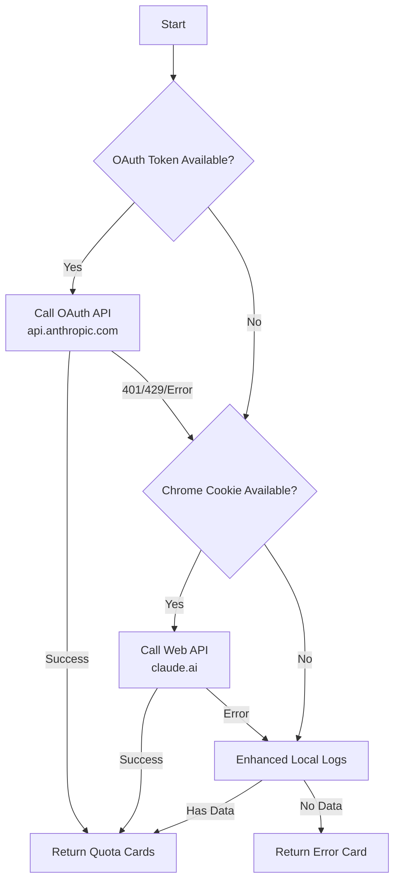
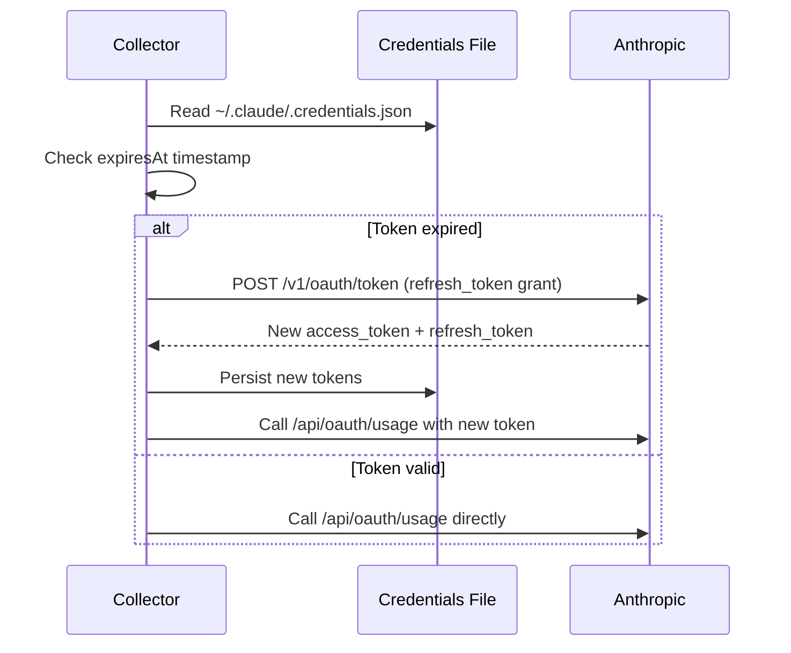

# Claude Collector

**File:** `app/services/collectors/anthropic.py`

Anthropic Claude quota collector with 4-tier fallback strategy for maximum resilience across different deployment scenarios.

---

## Overview

The Claude collector retrieves usage and quota information for Claude (Anthropic) across multiple quota windows (5-hour session, 7-day weekly, model-specific windows, and extra usage). It implements a robust fallback strategy to ensure data availability even when primary authentication methods fail.

### Key Features

- **4-Tier Fallback Strategy**: OAuth API → Web API (cookies) → Enhanced Local Logs → Error Cards
- **Chrome Cookie Authentication**: Extracts session cookies from Chrome when OAuth unavailable
- **Enhanced Local Parsing**: Tracks all token types (input, cache_read, cache_creation, output) with deduplication
- **Multi-Config Support**: Scans multiple config directories via `CLAUDE_CONFIG_DIR`
- **macOS Keychain Support**: Sidecar can extract tokens from macOS Keychain
- **OAuth Caching**: 10-minute cache to handle rate limits gracefully
- **Automatic Token Refresh**: Refreshes expired OAuth tokens using platform.claude.com endpoint

---

## Collection Strategy (Priority Order)



---

## Data Sources

### 1. Primary: OAuth API

**Endpoint:** `https://api.anthropic.com/api/oauth/usage`

**Authentication:** OAuth Bearer token

**Token Sources (in priority order):**

| Priority | Source | Method |
|----------|--------|--------|
| 1 | Environment | `CLAUDE_CODE_OAUTH_TOKEN` env var |
| 2 | Credentials File | `~/.claude/.credentials.json` |
| 3 | macOS Keychain | `security find-generic-password -s "Claude Code-credentials"` |

**Headers:**
```
Authorization: Bearer <token>
anthropic-beta: oauth-2025-04-20
```

**Quota Windows:**

| API Key | Display Name | Description |
|---------|--------------|-------------|
| `five_hour` | Session Window | 5-hour rolling quota (2M tokens for Pro) |
| `seven_day` | Weekly Window | 7-day rolling quota |
| `seven_day_sonnet` | Sonnet Weekly | Sonnet-specific 7-day quota |
| `seven_day_opus` | Opus Weekly | Opus-specific 7-day quota |
| `extra_usage` | Extra Usage | Monthly spend/limit (if enabled) |

**Response Format:**
```json
{
  "five_hour": {
    "utilization": 0.25,
    "resets_at": "2026-04-07T15:00:00Z"
  },
  "seven_day": {
    "utilization": 0.15,
    "resets_at": "2026-04-14T10:00:00Z"
  }
}
```

---

### 2. Secondary: Web API (Chrome Cookies)

**Use Case:** When OAuth token unavailable but user logged into claude.ai in Chrome

**Process:**
1. Extract `sessionKey` cookie from Chrome's cookie store for `claude.ai` domain
2. Call `/api/organizations` to get organization UUID
3. Call `/api/organizations/{orgId}/usage` to get quota data

**Endpoints:**

| Endpoint | URL | Purpose |
|----------|-----|---------|
| Organizations | `claude.ai/api/organizations` | Get org UUID |
| Usage | `claude.ai/api/organizations/{orgId}/usage` | Get quotas |
| Overage | `claude.ai/api/organizations/{orgId}/overage_spend_limit` | Extra usage |

**Cookie Extraction:**

Cross-platform support via `app/core/chrome_cookies.py`:

| Platform | Method | Key Storage |
|----------|--------|-------------|
| macOS | AES-256-GCM | Keychain ("Chrome Safe Storage") |
| Windows | DPAPI | Windows Data Protection |
| Linux | AES-256-GCM or plaintext | Secret Service or unencrypted |

**Response Format (Web API):**
```json
{
  "current_window": {
    "percentUsed": 25.0,
    "resetsAt": "2026-04-07T15:00:00Z"
  },
  "current_week": {
    "percentUsed": 15.0,
    "resetsAt": "2026-04-14T10:00:00Z"
  },
  "current_week_sonnet": {
    "percentUsed": 10.0,
    "resetsAt": "2026-04-14T10:00:00Z"
  }
}
```

---

### 3. Tertiary: Enhanced Local Cost Usage

**Location:** Multiple config directories (see below)

**Files:** `**/*.jsonl` under project roots

**Config Directories (checked in order):**

1. `CLAUDE_CONFIG_DIR` environment variable (comma-separated paths supported)
2. `~/.config/claude/projects` (XDG config)
3. `~/.claude/projects` (legacy)

**Token Types Tracked:**

| Token Type | API Key | Description |
|------------|---------|-------------|
| Input | `input_tokens` | Standard input tokens |
| Output | `output_tokens` | Generated output tokens |
| Cache Read | `cache_read_tokens` | Prompt cache read |
| Cache Creation | `cache_creation_tokens` | Prompt cache write |

**Deduplication:**
- Key: `(message.id, requestId)`
- Purpose: Handles streaming chunks where usage is cumulative

**Time Window:** Last 5 hours (matches OAuth session window)

**Log Entry Format:**
```json
{
  "type": "assistant",
  "timestamp": "2026-04-07T10:30:00Z",
  "message": {
    "id": "msg_abc123",
    "requestId": "req_xyz789",
    "usage": {
      "input_tokens": 1000,
      "output_tokens": 500,
      "cache_read_tokens": 2000,
      "cache_creation_tokens": 0
    }
  }
}
```

---

### 4. Quaternary: Error Cards

When all methods fail, returns descriptive error:

| Scenario | Error Message |
|----------|---------------|
| OAuth configured but failed | `No data — OAuth failed & Logs empty` |
| Web cookie available but failed | `No data — Web API failed & Logs empty` |
| No auth available | `No data — Set CLAUDE_CODE_OAUTH_TOKEN or login to claude.ai` |

---

## Token Refresh

The collector implements automatic OAuth token refresh when tokens expire (8 hour lifetime).

### Refresh Endpoint

**URL:** `POST https://platform.claude.com/v1/oauth/token`

**Parameters (form-urlencoded):**

| Parameter | Value | Description |
|-----------|-------|-------------|
| `grant_type` | `refresh_token` | OAuth2 grant type |
| `refresh_token` | `sk-ant-ort01-...` | Refresh token from credentials file |
| `client_id` | `9d1c250a-e61b-44d9-88ed-5944d1962f5e` | Claude Code CLI client ID (public) |

### Refresh Flow



### Failure Handling

| Error Type | Response | Action |
|------------|----------|--------|
| `invalid_grant` | Terminal | Block refresh, require `claude login` |
| 4xx/5xx (transient) | Exponential backoff | Start at 30s, double up to 6h |
| Network errors | Exponential backoff | Same as HTTP errors |

### Token Persistence

On successful refresh, the collector updates `~/.claude/.credentials.json`:

```json
{
  "claudeAiOauth": {
    "accessToken": "sk-ant-oat01-...",
    "refreshToken": "sk-ant-ort01-...",
    "expiresAt": 1775622989071,
    "scopes": ["user:profile", "user:inference"]
  }
}
```

**Important:** Refresh tokens are single-use. Each refresh generates a new refresh token.

---

## Collection Flow

```mermaid
graph TD
    A[Start Collection] --> B{CLAUDE_CODE_OAUTH_TOKEN?}
    B -->|Yes| C[Call OAuth API]
    B -->|No| D{Chrome sessionKey?}
    
    C --> E{Success?}
    E -->|Yes| F[Cache & Return Cards]
    E -->|401/429/Error| D
    
    D -->|Yes| G[Call Web API]
    D -->|No| H[Try Local Logs]
    
    G --> I{Success?}
    I -->|Yes| J[Return Web Cards]
    I -->|Error| H
    
    H --> K{Has Data?}
    K -->|Yes| L[Return Local Card<br/>tagged (API Fallback)]
    K -->|No| M[Return Error Card]
    
    F --> N[End]
    J --> N
    L --> N
    M --> N
```

---

## Output Formats

### OAuth/Web API Cards

```python
{
    "service": "Claude (Session Window)",
    "icon": "🟠",
    "remaining": "75.0%",
    "unit": "capacity",
    "reset": "in 2h 15m",
    "health": "good",           # < 70% used
    "pace": "Stable",           # < 50% used
    "detail": "25.0% used [OAuth]",  # or [Web API]
    # Extended fields
    "used_value": 25.0,
    "limit_value": 100.0,
    "is_unlimited": False,
    "unit_type": "percent",
    "reset_at": "2026-04-07T15:00:00+00:00",
    "data_source": "oauth"      # or "web_api"
}
```

### Local Log Fallback Card

```python
{
    "service": "Claude Pro",
    "icon": "🟠",
    "remaining": "1,250,000",
    "unit": "tokens / 5h",
    "reset": "in 3h 45m",
    "health": "good",
    "pace": "Stable",
    "detail": "750,000 / 2,000,000 [Local Logs] (API Fallback)",
    # Extended fields
    "used_value": 750000.0,
    "limit_value": 2000000.0,
    "is_unlimited": False,
    "unit_type": "tokens",
    "reset_at": "2026-04-07T15:00:00+00:00",
    "data_source": "local"
}
```

### Error Card

```python
{
    "service": "Claude Pro",
    "icon": "🟠",
    "remaining": "ERR",
    "unit": "Check State",
    "reset": "—",
    "health": "critical",
    "pace": "Stopped",
    "detail": "No data — Set CLAUDE_CODE_OAUTH_TOKEN or login to claude.ai",
    "data_source": "fallback"
}
```

---

## Health Calculation

Based on **utilization percentage** (% used, not remaining):

```python
if pct_used < 70:
    health = "good"      # Green
elif pct_used < 90:
    health = "warning"   # Yellow
else:
    health = "critical"  # Red
```

---

## Pace Calculation

| Usage | Pace | Meaning |
|-------|------|---------|
| < 50% | "Stable" | Normal consumption rate |
| 50-80% | "Moderate Burn" | Elevated usage |
| > 80% | "Fast Burn" | Approaching limit |
| 100%+ | "Exhausted" | Quota exceeded |

---

## Configuration

### Environment Variables

| Variable | Default | Description |
|----------|---------|-------------|
| `CLAUDE_CODE_OAUTH_TOKEN` | (auto-detect) | OAuth token for API access |
| `CLAUDE_CONFIG_DIR` | (see below) | Comma-separated paths to Claude config directories |

### File Paths

| File | Location | Purpose |
|------|----------|---------|
| Credentials | `~/.claude/.credentials.json` | OAuth token storage |
| Projects (legacy) | `~/.claude/projects/` | Project log files |
| Projects (XDG) | `~/.config/claude/projects/` | XDG-compliant log files |
| Chrome Cookies | Platform-dependent | Session cookie extraction |
| macOS Keychain | `Claude Code-credentials` | Alternative token storage |

### CLAUDE_CONFIG_DIR Format

Supports comma-separated paths:
```bash
export CLAUDE_CONFIG_DIR="~/.claude,~/.config/claude,/custom/path"
```

Each path will have `/projects` appended automatically if not present.

---

## Sidecar Implementation

**File:** `scripts/sidecar.py` → `AnthropicCollector`

The sidecar collector has **dual-mode token extraction**:

### Mode 1: File-based (Primary)

Reads from `~/.claude/.credentials.json`:
```python
with open("~/.claude/.credentials.json") as f:
    data = json.load(f)
    token = data.get("claudeAiOauth", {}).get("accessToken")
```

### Mode 2: macOS Keychain (Fallback)

Extracts from macOS Keychain (for sidecar scenarios):
```bash
security find-generic-password -s "Claude Code-credentials" -w
```

This allows the sidecar to work even when credentials are stored in keychain only.

---

## Troubleshooting

### Issue: "No data — OAuth missing & Logs empty"

**Causes:**
1. No `CLAUDE_CODE_OAUTH_TOKEN` env var
2. No `~/.claude/.credentials.json` file
3. Not logged into claude.ai in Chrome
4. No project log files found

**Fix:**
```bash
# Option 1: Set env var
export CLAUDE_CODE_OAUTH_TOKEN="sk-ant-..."

# Option 2: Login to Claude Code (creates credentials file)
claude login

# Option 3: Login to claude.ai in Chrome (enables Web API)
# Then dashboard will use cookie-based access
```

### Issue: OAuth works but shows cached data

**Expected:** `[Cached]` tag in detail field means results are from 10-minute cache

**To force refresh:** Wait 10 minutes or restart the app

### Issue: Web API returns empty

**Check Chrome cookie:**
```bash
python3 -c "from app.core.chrome_cookies import get_claude_session_cookie; print(get_claude_session_cookie()[:20] if get_claude_session_cookie() else 'None')"
```

**Causes:**
- Not logged into claude.ai in Chrome
- Cookie expired (session cookies are temporary)
- Chrome using different profile

**Fix:** Log into https://claude.ai in Chrome

### Issue: Local logs show different numbers than OAuth/Web

**Expected:** OAuth/Web aggregate usage across ALL Claude usage (web IDE, CLI, API)
**Local logs:** Show only CLI usage on current machine

This is normal - OAuth/Web are authoritative when available.

### Issue: Cookie decryption fails on macOS

**Cause:** Keychain permission denied

**Fix:**
```bash
# Grant terminal permission to access Keychain
security add-generic-password -s "Chrome Safe Storage" -w

# Or run with accessibility permissions
```

### Issue: Token not found in keychain

**Check:**
```bash
security find-generic-password -s "Claude Code-credentials" -g
```

If empty, credentials are stored in file only (not keychain).

---

## Future Options

### Potential: CLI PTY Parsing (5th Tier Fallback)

**Source:** CodexBar documentation mentions `ClaudeCLISession` with `/usage` command

**What it is:** Spawn `claude` CLI in a PTY and parse `/usage` output:
```
Current session
  25% used
  Resets in 2h 15m

Current week  
  15% used
  Resets in 3d 12h
```

**Implementation approach:**
```python
async def _collect_via_cli_pty(self) -> List[Dict[str, Any]]:
    """Quaternary fallback: Parse `claude /usage` CLI output."""
    import pty
    import os
    
    # Spawn Claude CLI in PTY
    pid, fd = pty.fork()
    if pid == 0:
        # Child process
        os.execvp("claude", ["claude", "--allowed-tools", ""])
    else:
        # Parent process
        # Send /usage command
        # Read and parse output
        ...
```

**Pros:**
- No credentials required (uses CLI's own auth)
- Same data as OAuth/Web
- Works in containerized environments with CLI installed

**Cons:**
- Requires `claude` CLI binary
- Complex PTY handling
- Slower (process spawn + interaction)
- Fragile parsing (format could change)
- Adds maintenance burden

**Comparison:**

| Method | Requires | Data Quality | Speed | Reliability |
|--------|----------|--------------|-------|-------------|
| OAuth API | Token | ⭐⭐⭐ Complete | Fast | High |
| Web API | Chrome cookie | ⭐⭐⭐ Complete | Fast | High |
| Local Logs | Log files | ⭐⭐ Token counts | Fast | Medium |
| CLI PTY | CLI binary | ⭐⭐⭐ Complete | Slow | Low |

**Decision:** **Not implemented currently.** The 4-tier strategy covers most use cases:
- OAuth API: Primary for users with Claude Code
- Web API: Secondary for users with web access
- Local Logs: Tertiary for offline/local-only usage

**If needed in future:** Would slot as 4th tier (before error cards):
```
OAuth API → Web API → Local Logs → CLI PTY → Error Cards
```

---

### Potential: Firefox/Safari Cookie Support

**Current:** Only Chrome supported

**Future:** Could extend `chrome_cookies.py` to support:
- Firefox (`~/.mozilla/firefox/*/cookies.sqlite`)
- Safari (`~/Library/Cookies/Cookies.binarycookies`)
- Edge (Chromium-based, similar to Chrome)

**Priority:** Low (Chrome covers 80%+ of users)

See `docs/ideas.md` for tracking.

---

### Potential: Windows Credential Store

**Current:** macOS Keychain supported

**Future:** Add Windows Credential Manager support for sidecar token extraction

**Priority:** Low (Windows users typically use credentials file)

---

### Alternative Endpoint: v1/rate_limits

**Endpoint:** `https://api.anthropic.com/v1/rate_limits`

**Difference from /api/oauth/usage:**

| Aspect | /api/oauth/usage | /v1/rate_limits |
|--------|------------------|-----------------|
| **Data Structure** | Multiple quota windows (5h, 7d, Sonnet, Opus) | Single window (requests + tokens) |
| **Fields** | `utilization`, `resets_at` per window | `requests_remaining/limit`, `tokens_remaining/limit` |
| **Account Info** | Includes `account` object | Includes `account` object |
| **Granularity** | High (per-window utilization) | Low (aggregate limits) |

**v1/rate_limits Response Format:**
```json
{
  "rate_limit": {
    "requests_remaining": 70,
    "requests_limit": 100,
    "tokens_remaining": 80000,
    "tokens_limit": 100000,
    "resets_at": "2026-01-18T12:00:00Z"
  },
  "usage": {
    "input_tokens": 15000,
    "output_tokens": 5000
  },
  "account": {
    "email": "user@example.com",
    "organization": "org-name",
    "plan": "pro"
  }
}
```

**Use Case:**
- Fallback if `/api/oauth/usage` fails or returns incomplete data
- Alternative data source for simpler use cases
- Provides aggregate request + token limits vs per-window breakdown

**Decision:** **Not currently implemented.** The Web API (`claude.ai/api`) provides better data quality as a secondary source (same per-window granularity as OAuth). The v1/rate_limits endpoint could be added as a fallback between OAuth and Web API if needed:

```
OAuth API (/api/oauth/usage) → v1/rate_limits (simpler data) → Web API (cookies) → Local Logs → Error
```

**Priority:** Low (current 4-tier strategy is sufficient)

---

## Related Files

| File | Purpose |
|------|---------|
| `app/services/collectors/anthropic.py` | Main collector implementation (with token refresh) |
| `app/core/chrome_cookies.py` | Cross-platform cookie decryption |
| `app/core/config.py` | Token source configuration |
| `app/services/token_cache.py` | In-memory token cache for sidecar tokens |
| `app/services/smart_collector.py` | Intelligent caching wrapper |
| `scripts/sidecar.py` | Sidecar implementation (file + keychain) |
| `tests/unit/test_collectors.py` | Unit tests |

## OAuth Client ID

The OAuth client ID used for token refresh is a **public identifier** from Claude Code CLI:

```python
CLAUDE_OAUTH_CLIENT_ID = "9d1c250a-e61b-44d9-88ed-5944d1962f5e"
```

This is the same client ID used by the official Claude Code CLI tool. It's publicly visible in the codebase and is not a secret.

---

## References

- **Anthropic OAuth API:** https://api.anthropic.com/api/oauth/usage
- **Claude Web:** https://claude.ai
- **Chrome Cookie Decryption:** Based on Chromium source
- **CodexBar Documentation:** `docs/competitors.md` (Claude provider section)

## Troubleshooting

### Issue: "No Auth" or "Missing Token" error
**Cause:** No OAuth token found in any source
**Fix:**
1. Set `CLAUDE_CODE_OAUTH_TOKEN` environment variable
2. Or login to https://claude.ai in Chrome (allows cookie extraction)
3. Or on macOS, ensure Claude Code CLI is configured (uses keychain)

### Issue: "401 Unauthorized" error
**Cause:** Token expired or invalid
**Fix:**
1. **Automatic refresh should handle this** - check logs for refresh attempts
2. If refresh fails with `invalid_grant`: Run `claude login` to re-authenticate
3. If refresh fails with other errors: Wait for backoff (30s → 60s → 120s... up to 6h)
4. Manual fix: Generate new token from https://claude.ai/settings

### Issue: "Token refresh blocked" or "invalid_grant"
**Cause:** Refresh token is invalid or revoked
**Fix:**
```bash
# Re-authenticate with Claude Code CLI
claude login

# This will update ~/.claude/.credentials.json with fresh tokens
```

### Issue: Token refresh keeps failing
**Cause:** Exponential backoff after repeated failures
**Fix:**
1. Check network connectivity to `platform.claude.com`
2. Verify credentials file has valid refresh token
3. Wait for backoff period or restart the app
4. Check logs for specific error codes

### Issue: Dashboard shows stale data
**Cause:** OAuth has 5-minute cache
**Fix:** Wait 5 minutes for next window, or use web API fallback (slower)

### Issue: No local log fallback
**Cause:** `~/.claude/` directory doesn't exist
**Fix:**
1. Use Claude Code CLI at least once to create logs
2. Or rely on OAuth/web API methods

---

*Last updated: 2026-04-07*
