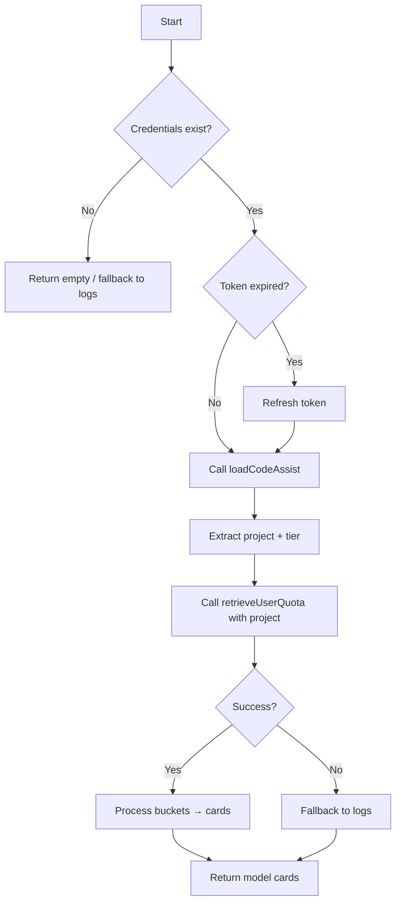

# Gemini Collector

**File:** `app/services/collectors/gemini.py`

Google Gemini CLI quota collector with OAuth-backed API and local log fallback.

---

## Overview

The Gemini collector retrieves quota information for the Gemini CLI tool, supporting multiple model families (2.5, 3.x preview models) with per-model quota tracking.

### Key Features

- **OAuth Token Auto-Refresh**: Automatically refreshes expired tokens and saves back to credentials file
- **Project Discovery**: Discovers the user's Google Cloud project to fetch all model quotas (including gemini-3)
- **Multi-Model Support**: Returns one card per model with individual quota status
- **Tier Detection**: Shows current subscription tier (Gemini Code Assist, Google One AI Pro)

---

## Data Sources

### 1. Primary: Google Cloud Code API (OAuth)

**Endpoints:**

| Endpoint | Purpose | Body | Response |
|----------|---------|------|----------|
| `cloudcode-pa.googleapis.com/v1internal:loadCodeAssist` | Get tier + project | `{"metadata": {"ideType": "GEMINI_CLI", "pluginType": "GEMINI"}}` | `currentTier`, `cloudaicompanionProject` |
| `cloudcode-pa.googleapis.com/v1internal:retrieveUserQuota` | Get quotas | `{"project": "<projectId>"}` | `buckets[]` |

**Authentication:**
- Credentials: `~/.gemini/oauth_creds.json`
- Token refresh: `oauth2.googleapis.com/token`

**Critical Discovery:**

The **project parameter is required** to get gemini-3 model quotas:

```python
# Without project (OLD - returns 3 models)
{"project": ""}  # → gemini-2.5-flash, gemini-2.5-flash-lite, gemini-2.5-pro

# With discovered project (NEW - returns 7 models)
{"project": "climbing-engine-hczq7"}  # → All models including gemini-3*
```

### 2. Secondary: Local Session Logs

**Location:** `~/.gemini/tmp/sessions/*.jsonl`

**Fallback Trigger:** OAuth credentials missing or API failure

**Data Parsed:**
- `prompt_tokens` + `completion_tokens` from usage field
- 24-hour rolling window

---

## Collection Flow



---

## Quota Bucket Structure

### API Response Format

```json
{
  "buckets": [
    {
      "modelId": "gemini-2.5-flash",
      "remainingFraction": 1.0,
      "resetTime": "2026-04-08T13:23:17Z",
      "tokenType": "REQUESTS"
    },
    {
      "modelId": "gemini-3-pro-preview",
      "remainingFraction": 1.0,
      "resetTime": "2026-04-08T13:23:17Z",
      "tokenType": "REQUESTS"
    }
  ]
}
```

### Field Mapping

| API Field | Display Value | Notes |
|-----------|---------------|-------|
| `modelId` | Service name (via `MODEL_DISPLAY_NAMES`) | Maps to friendly names |
| `remainingFraction` | `% used` + `% remaining` | `1.0` = 100% remaining = 0% used |
| `resetTime` | Reset time display | ISO-8601 parsed to "Resets at HH:MM" |
| `tokenType` | (not shown) | Always "REQUESTS" |

### Model Display Names

| Raw Model ID | Display Name |
|--------------|--------------|
| `gemini-2.5-flash` | Gemini 2.5 Flash |
| `gemini-2.5-flash-lite` | Gemini 2.5 Flash Lite |
| `gemini-2.5-pro` | Gemini 2.5 Pro |
| `gemini-3-flash-preview` | Gemini 3 Flash (Preview) |
| `gemini-3-pro-preview` | Gemini 3 Pro (Preview) |
| `gemini-3.1-flash-lite-preview` | Gemini 3.1 Flash Lite (Preview) |
| `gemini-3.1-pro-preview` | Gemini 3.1 Pro (Preview) |

---

## Tier Detection

### Response Format

```json
{
  "currentTier": {
    "id": "standard-tier",
    "name": "Gemini Code Assist",
    "description": "Unlimited coding assistant..."
  },
  "paidTier": {
    "id": "g1-pro-tier",
    "name": "Gemini Code Assist in Google One AI Pro"
  },
  "cloudaicompanionProject": "climbing-engine-hczq7"
}
```

### Display Logic

- **Current tier** shown in `pace` field
- **Project ID** used for quota API call (required for gemini-3)

### Tier Types

| Tier ID | Name | Quota Behavior |
|---------|------|----------------|
| `standard-tier` | Gemini Code Assist | High/"unlimited" quotas (typically 100% remaining) |
| `g1-pro-tier` | Gemini Code Assist in Google One AI Pro | Higher quotas, may show usage |
| `free-tier` | (rare) | Limited quotas with actual usage tracking |

---

## Token Refresh Flow

### Credentials File (`~/.gemini/oauth_creds.json`)

```json
{
  "access_token": "ya29...",
  "refresh_token": "1//...",
  "expiry_date": 1775570736679,
  "id_token": "eyJ..."
}
```

### Refresh Process

1. Check `expiry_date < now * 1000` (ms precision)
2. If expired, POST to `oauth2.googleapis.com/token`
3. Update `access_token` and `expiry_date` in memory
4. Write updated credentials back to file

---

## Health Calculation

Based on **% used** (not remaining):

```python
if percent_used < 50:
    health = "good"      # Green
elif percent_used < 80:
    health = "warning"   # Yellow
else:
    health = "critical"  # Red
```

**Why % used?**
- Standard tier shows 100% remaining (0% used) when quota is fresh
- This matches the Gemini CLI output showing "0%" for unused quota

---

## Output Format

### API Mode (Primary)

```python
{
    "service": "Gemini 3 Pro (Preview)",
    "icon": "🔵",
    "remaining": "0%",           # % used
    "unit": "used",
    "reset": "Resets at 13:44",
    "health": "good",            # Based on % used
    "pace": "Gemini Code Assist", # Current tier
    "detail": "100% remaining | Model: gemini-3-pro-preview"
}
```

### Log Fallback Mode

```python
{
    "service": "Gemini CLI (Logs)",
    "icon": "🔵",
    "remaining": "1,234",        # Token count
    "unit": "tokens (24h)",
    "reset": "Rolling 24h",
    "health": "good",
    "pace": "Stable",
    "detail": "Fallback: Local logs"
}
```

---

## Troubleshooting

### Issue: Missing gemini-3 models

**Cause:** Project parameter not provided

**Fix:** Ensure `loadCodeAssist` returns valid `cloudaicompanionProject`

**Test:** Run `scripts/test_gemini_investigation.py`

### Issue: Token refresh fails

**Cause:** Missing `GEMINI_OAUTH_CLIENT_ID` and `GEMINI_OAUTH_CLIENT_SECRET`

**Check:**
```bash
echo $GEMINI_OAUTH_CLIENT_ID
echo $GEMINI_OAUTH_CLIENT_SECRET
```

**Fix:** Extract from Gemini CLI installation:
- Homebrew: `.../libexec/lib/node_modules/@google/gemini-cli/node_modules/@google/gemini-cli-core/dist/src/code_assist/oauth2.js`
- npm/bun: `.../node_modules/@google/gemini-cli-core/dist/src/code_assist/oauth2.js`

### Issue: Always shows 0% used

**Expected behavior:** Standard tier typically shows 100% remaining (0% used)

**Why:** The quotas are very high for standard tier, essentially "unlimited" for normal usage

**To see actual usage:** Use up quota or check if on limited/free tier

---

## Future Options

### Potential: CLI `/stats` Parsing (Tertiary Fallback)

**Source:** CodexBar documentation mentions `GeminiStatusProbe.parse(text:)` can parse `/stats` output.

**What it is:** The Gemini CLI has a `/stats` command that outputs formatted quota tables:
```
│  Model                   Reqs    Model usage                 Usage resets
│  ────────────────────────────────────────────────────────────────────────────────
│  gemini-2.5-flash           -    ▬▬▬▬▬▬▬▬▬▬▬▬▬▬▬▬▬▬▬▬    0%  3:30 PM (24h)
│  gemini-3-pro-preview       -    ▬▬▬▬▬▬▬▬▬▬▬▬▬▬▬▬▬▬▬▬    0%  3:30 PM (24h)
```

**Implementation approach:**
```python
async def _collect_via_cli_stats(self) -> List[Dict[str, Any]]:
    """Tertiary fallback: Parse `gemini /stats` CLI output."""
    try:
        proc = await asyncio.create_subprocess_exec(
            "gemini", "/stats",
            stdout=asyncio.subprocess.PIPE
        )
        stdout, _ = await proc.communicate()
        # Parse table format to extract model, usage %, reset time
        ...
    except FileNotFoundError:
        return []  # gemini CLI not installed
```

**Pros:**
- No OAuth credentials required
- Shows quota % (better than raw token counts from logs)
- Always includes all models (gemini-3 included)

**Cons:**
- Requires gemini CLI binary to be installed
- Slower (subprocess execution)
- Fragile parsing (format could change)
- Adds maintenance burden

**Comparison:**

| Method | Requires | Data Quality | Speed | Reliability |
|--------|----------|--------------|-------|-------------|
| OAuth API | Credentials | ⭐⭐⭐ Complete | Fast | High |
| Session Logs | Log files | ⭐⭐ Token counts only | Fast | Medium |
| CLI `/stats` | CLI binary | ⭐⭐⭐ Quota % visible | Slow | Low |

**Decision:** **Not implemented currently.** The session log fallback is sufficient for most cases. OAuth API covers the primary use case well.

**If needed in future:** Would slot between OAuth API and session logs:
```
OAuth API → CLI /stats (quota %) → Session Logs (token counts)
```

---

## Related Files

| File | Purpose |
|------|---------|
| `app/services/collectors/gemini.py` | Main collector implementation |
| `scripts/sidecar.py` | Sidecar version (sync API) |
| `scripts/test_gemini_api.py` | Basic API test |
| `scripts/test_gemini_investigation.py` | Deep investigation with project comparison |
| `tests/unit/test_collectors.py` | Unit tests |

---

## References

- **CodexBar Documentation:** `docs/competitors.md` (Section: Gemini provider)
- **Google OAuth:** https://oauth2.googleapis.com/token
- **Cloud Code API:** Internal Google endpoint (undocumented)

---

*Last updated: 2026-04-07*
