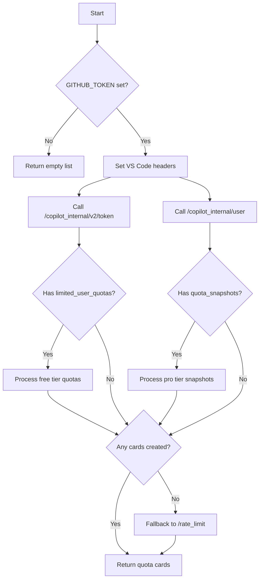

# GitHub Copilot Collector

**File:** `app/services/collectors/github.py`

GitHub Copilot quota collector with tier-aware multi-endpoint strategy.

---

## Overview

The GitHub Copilot collector retrieves quota information for GitHub Copilot, supporting multiple subscription tiers (Free/Limited, Pro, Enterprise) with different API response formats.

### Key Features

- **Tier-Aware Collection**: Automatically detects and handles Free, Pro, and Enterprise tier responses
- **Multi-Endpoint Strategy**: Queries both `/copilot_internal/v2/token` and `/copilot_internal/user` endpoints
- **VS Code Header Mimicking**: Uses VS Code Copilot extension headers for API reliability
- **Smart Fallback**: Falls back to standard GitHub API rate limits if Copilot endpoints unavailable

---

## Data Sources

### 1. Primary: GitHub Copilot Internal APIs

**Endpoints:**

| Endpoint | Purpose | Tier Coverage | Key Fields |
|----------|---------|---------------|------------|
| `api.github.com/copilot_internal/v2/token` | Copilot token + quotas | Free/Limited/Pro | `limited_user_quotas`, `limited_user_reset_date` |
| `api.github.com/copilot_internal/user` | User profile + quotas | Pro/Enterprise | `quota_snapshots`, `copilot_plan` |

**Authentication:**
- Token: `GITHUB_TOKEN` environment variable
- Header: `Authorization: token <token>` (note: `token` format, not `Bearer`)

**Headers (VS Code Mimicking):**

The collector mimics VS Code Copilot extension headers as suggested by CodexBar:

```python
headers = {
    "Authorization": f"token {token}",
    "X-GitHub-Api-Version": "2025-04-01",
    "Accept": "application/json",
    "Editor-Version": "vscode/1.96.2",
    "Editor-Plugin-Version": "copilot-chat/0.26.7",
    "User-Agent": "GitHubCopilotChat/0.26.7"
}
```

**Why VS Code headers?**
- Improves API reliability (some endpoints behave differently without client headers)
- Matches the official Copilot extension behavior
- Bypasses certain rate limiting or access restrictions

### 2. Fallback: Standard GitHub API

**Endpoint:** `api.github.com/rate_limit`

**Trigger:** When neither Copilot endpoint returns usable data

**Use Case:** Shows core API rate limits as a proxy when Copilot-specific quotas unavailable

---

## Collection Flow



---

## Response Formats by Tier

### Free/Limited Tier

**Source:** Either endpoint may return this structure

```json
{
  "limited_user_quotas": {
    "completions": 45,
    "chat": 120
  },
  "limited_user_reset_date": "2025-04-08T00:00:00Z",
  "monthly_quotas": {
    "completions": 100,
    "chat": 300
  }
}
```

**Fields:**
- `limited_user_quotas`: Current remaining quotas
- `limited_user_reset_date`: When quotas reset (ISO-8601)
- `monthly_quotas`: Total monthly allowance (optional)

### Pro/Enterprise Tier

**Source:** Primarily from `/copilot_internal/user`

```json
{
  "quota_snapshots": [
    {
      "metric": "premium_interactions",
      "remaining": 450,
      "entitlement": 500
    },
    {
      "metric": "chat",
      "remaining": 890,
      "entitlement": 1000
    },
    {
      "metric": "completions",
      "remaining": 5000,
      "entitlement": 5000
    }
  ],
  "copilot_plan": "Pro"
}
```

**Fields:**
- `quota_snapshots[]`: Array of quota metrics
  - `metric`: Internal metric name
  - `remaining`: Remaining quota
  - `entitlement`: Total allowed quota
- `copilot_plan`: Plan type ("Pro", "Enterprise", "Individual", etc.)

---

## Metric Name Mapping

| Internal Name | Display Name | Description |
|---------------|--------------|-------------|
| `premium_interactions` | Premium Interactions | Advanced Copilot features |
| `chat` | Chat Usage | Copilot Chat messages |
| `completions` | Autocomplete | Code completions/suggestions |

**Mapping Logic:**
```python
metric_map = {
    "premium_interactions": "Premium Interactions",
    "chat": "Chat Usage",
    "completions": "Autocomplete"
}
metric = metric_map.get(metric_raw, metric_raw.replace("_", " ").title())
```

---

## Health Calculation

### Free/Limited Tier

Based on **absolute remaining count**:

```python
if val > 10:
    health = "good"
else:
    health = "warning"  # or "critical" if very low
```

**Thresholds:**
- Good: > 10 requests remaining
- Warning: ≤ 10 requests

### Pro/Enterprise Tier

Based on **percentage remaining**:

```python
pct_remaining = remaining / entitlement
if pct_remaining > 0.3:
    health = "good"
elif pct_remaining > 0.1:
    health = "warning"
else:
    health = "critical"
```

**Thresholds:**
- Good: > 30% remaining
- Warning: 10-30% remaining
- Critical: < 10% remaining

### Fallback Rate Limit

```python
if rem/lim > 0.3:
    health = "good"
else:
    health = "warning"
```

---

## Output Format

### Free/Limited Tier Card

```python
{
    "service": "Copilot (Completions)",
    "icon": "🐙",
    "remaining": "45",
    "unit": "/ 100",  # If monthly_quotas available
    "reset": "in 2h 30m",
    "health": "good",
    "pace": "Manual",
    "detail": "45/100 requests left • Free Tier"
}
```

### Pro/Enterprise Tier Card

```python
{
    "service": "Copilot (Chat Usage)",
    "icon": "🐙",
    "remaining": "890",
    "unit": "/ 1,000",
    "reset": "Rolling",
    "health": "good",
    "pace": "Sustainable",  # or "Fatigue" if >70% used
    "detail": "11.0% used • Pro [Pro Tier]"
}
```

### Fallback Rate Limit Card

```python
{
    "service": "GitHub API",
    "icon": "🐙",
    "remaining": "4,500",
    "unit": "requests",
    "reset": "in 45m",
    "health": "good",
    "pace": "Stable",
    "detail": "4500/5000 [API fallback]"
}
```

---

## Sidecar Implementation

**File:** `scripts/sidecar.py` → `class GitHubCollector`

The sidecar uses a **lighter implementation** for efficiency:

```python
class GitHubCollector:
    @staticmethod
    def collect():
        token = os.getenv("GITHUB_TOKEN")
        if not token: return []
        
        headers = {"Authorization": f"token {token}", "Accept": "application/json"}
        # Only fetch basic rate limit (lighter weight)
        data, code = http_get("https://api.github.com/rate_limit", headers)
        if code != 200: return []
        
        # Parse rate limit response...
```

**Differences from main collector:**

| Aspect | Main Collector | Sidecar |
|--------|---------------|---------|
| Endpoints | `/v2/token` + `/user` + `/rate_limit` fallback | `/rate_limit` only |
| Headers | Full VS Code headers | Minimal headers |
| Data | Tier-aware quotas | Basic API rate limits |
| Detail | Service-specific quotas | Generic "GitHub API" |

**Rationale:** Sidecar prioritizes speed and simplicity; full tier detection happens on main server.

---

## Troubleshooting

### Issue: No Copilot data returned

**Check:**
1. Is `GITHUB_TOKEN` set?
   ```bash
   echo $GITHUB_TOKEN
   ```

2. Does token have Copilot scope?
   ```bash
   # Check via API
   curl -H "Authorization: Bearer $GITHUB_TOKEN" \
        https://api.github.com/user \
        -H "Accept: application/vnd.github.v3+json"
   ```
   Look for `X-OAuth-Scopes` header containing `copilot`

3. Is the user subscribed to Copilot?
   - Free tier: Should return `limited_user_quotas`
   - Pro tier: Should return `quota_snapshots`
   - No subscription: May return empty or 403

### Issue: Wrong tier detected

**Cause:** Both endpoints may return data; collector processes both

**Behavior:**
- Free tier user might see cards from both endpoints
- Pro tier user will see `quota_snapshots` (preferred)

**Check actual tier:**
```bash
curl -H "Authorization: token $GITHUB_TOKEN" \
     https://api.github.com/copilot_internal/user
```
Look for `copilot_plan` field.

### Issue: API returns 401/403

**Possible causes:**
- Token expired or revoked
- Token lacks `copilot` OAuth scope
- User not authorized for Copilot

**Fix:**
1. Regenerate token at https://github.com/settings/tokens
2. Ensure "Copilot" scope is granted
3. Verify Copilot subscription at https://github.com/settings/copilot

### Issue: VS Code headers not working

**Test without headers:**
```bash
curl -H "Authorization: token $GITHUB_TOKEN" \
     https://api.github.com/copilot_internal/v2/token
```

If this works, the VS Code headers may not be necessary for your token type.

---

## Future Options

### Potential: GitHub Device Flow OAuth

**Source:** Listed in `docs/ideas.md`

**What it is:** Official GitHub OAuth Device Flow for headless environments

**Benefits:**
- No manual token copy-pasting
- Works in Docker/containers
- Automatic token refresh

**Implementation sketch:**
```python
# 1. Initiate device flow
resp = await client.post(
    "https://github.com/login/device/code",
    data={"client_id": GITHUB_CLIENT_ID, "scope": "copilot"}
)
data = resp.json()
device_code = data["device_code"]
user_code = data["user_code"]

# 2. Display user_code to user
print(f"Enter code {user_code} at github.com/login/device")

# 3. Poll for access token
while True:
    resp = await client.post(
        "https://github.com/login/oauth/access_token",
        data={"client_id": GITHUB_CLIENT_ID, "device_code": device_code}
    )
    if "access_token" in resp.json():
        break
    await asyncio.sleep(5)
```

**Decision:** **Not implemented currently.** Current token-based approach is simpler and sufficient for most use cases.

**If needed in future:** Would add to `docs/ideas.md` as high priority for Docker/headless deployments.

---

## Related Files

| File | Purpose |
|------|---------|
| `app/services/collectors/github.py` | Main collector implementation |
| `scripts/sidecar.py` | Sidecar version (rate limit only) |
| `scripts/debug_github_api.py` | Debug script to test all endpoints |
| `tests/unit/test_collectors.py` | Unit tests (`TestGitHubCollector`) |
| `tests/conftest.py` | Mock response fixtures |

---

## References

- **GitHub Copilot API:** Internal/undocumented endpoints
- **GitHub OAuth:** https://docs.github.com/en/apps/oauth-apps/building-oauth-apps/authorizing-oauth-apps#device-flow
- **CodexBar:** `docs/competitors.md` (Section: GitHub provider)

---

*Last updated: 2026-04-07*
