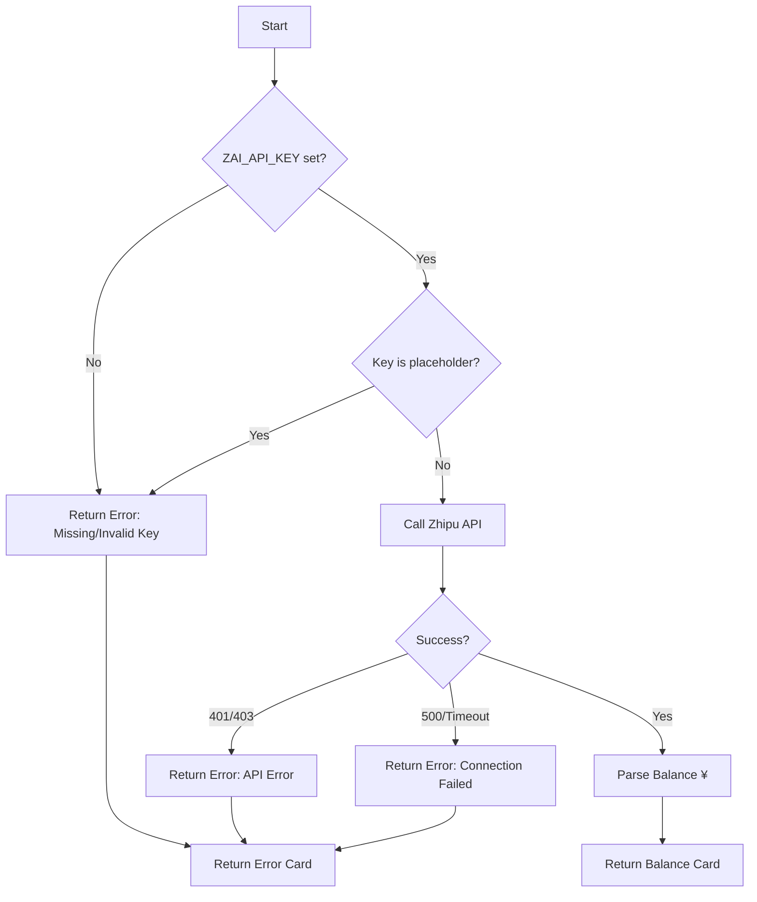

# zAI Collector

**File:** `app/services/collectors/zai.py`

Zhipu AI (GLM) quota collector with prepaid balance tracking in Chinese Yuan (¥).

---

## Overview

The zAI collector retrieves prepaid account balance from Zhipu AI's GLM models. Unlike quota-based providers, zAI uses a simple prepaid credit model where you add funds to your account and usage deducts from that balance.

### Key Features

- **Prepaid Balance Model**: Shows account balance (¥) rather than usage quotas
- **Simple API**: Single endpoint call with Bearer token authentication
- **Placeholder Detection**: Validates key is not literally "zai"
- **Low Balance Warning**: Visual warning when balance drops below ¥10

---

## Data Source

### Primary: Zhipu AI Balance API

**Endpoint:** `https://open.bigmodel.cn/api/paas/v4/users/me/balance`

**Authentication:** Bearer token via `ZAI_API_KEY` environment variable

**Key Validation:**
- Checks key is not literally "zai" (common placeholder)
- Case-insensitive check ("ZAI", "Zai" also rejected)
- Returns error card if key missing or invalid

**Response Format:**
```json
{
  "data": {
    "available_balance": "125.50"
  }
}
```

**Model:** Prepaid credits in Chinese Yuan (CNY, ¥)

---

## Collection Flow



---

## Output Format

### Standard Card

```python
{
    "service": "zAI (GLM)",
    "icon": "🌐",
    "remaining": "¥125.50",      # Available balance
    "unit": "balance",
    "reset": "Manual",           # Prepaid - no automatic reset
    "health": "good",            # > ¥10 = good
    "pace": "Stable",
    "detail": "Prepaid balance"
}
```

### Error Card (Invalid Key)

```python
{
    "service": "zAI",
    "icon": "🌐",
    "remaining": "ERR",
    "unit": "Check State",
    "reset": "—",
    "health": "critical",
    "pace": "Stopped",
    "detail": "Missing/Invalid Key"
}
```

### Error Card (API Error)

```python
{
    "service": "zAI",
    "icon": "🌐",
    "remaining": "ERR",
    "unit": "Check State",
    "reset": "—",
    "health": "critical",
    "pace": "Stopped",
    "detail": "API Error (401)"
}
```

---

## Health Calculation

Based on **account balance**:

```python
if balance > 10:
    health = "good"      # Green
else:
    health = "warning"   # Yellow (low balance)
```

**Threshold:** ¥10 (~$1.40 USD)

**Note:** No "critical" threshold - service simply stops when balance reaches zero.

---

## Configuration

### Environment Variables

| Variable | Required | Description | Example |
|----------|----------|-------------|---------|
| `ZAI_API_KEY` | Yes | Zhipu AI API key | `sk-abc123...` |

### Getting an API Key

1. Sign up at https://open.bigmodel.cn/
2. Navigate to "API Keys" section (API密钥管理)
3. Generate a new key
4. Add funds to your account via the billing page

### File Permissions

No special file permissions required - only needs the API key in environment.

---

## Error Handling

| Scenario | Behavior | User Action |
|----------|----------|-------------|
| Missing key | Error card | Set `ZAI_API_KEY` env var |
| Placeholder key ("zai") | Error card | Replace with real API key |
| 401 Unauthorized | Error card | Check key validity, may be expired |
| Connection timeout | Error card | Check network, API may be down |
| Invalid JSON | Error card | API format changed, check for updates |

---

## Troubleshooting

### Issue: "Missing/Invalid Key" error

**Cause:** Environment variable not set or contains placeholder

**Fix:**
```bash
export ZAI_API_KEY="your-actual-key-here"
```

### Issue: "API Error (401)"

**Causes:**
- Invalid or expired API key
- Account suspended
- Key revoked

**Fix:** Generate new key at https://open.bigmodel.cn/

### Issue: Shows ¥0.00 balance

**Cause:** Account has no remaining credits

**Fix:** Add prepaid credits through Zhipu AI billing portal

### Issue: Connection Failed

**Cause:** Network issue or API endpoint down

**Check:**
```bash
curl -H "Authorization: Bearer $ZAI_API_KEY" \
  https://open.bigmodel.cn/api/paas/v4/users/me/balance
```

---

## Comparison: Prepaid vs Quota Models

| Aspect | zAI (Prepaid) | Quota-Based (Claude, etc.) |
|--------|---------------|---------------------------|
| **Metric** | Account balance (¥) | Token/request quotas |
| **Reset** | Manual (add credits) | Automatic (time-based) |
| **Health** | Based on remaining $ | Based on % used |
| **Overage** | Stops working | May have extra usage tier |
| **Display** | "¥125.50 balance" | "75% remaining" |

---

## Deployment Modes

### Standalone
Works directly with API key from environment. No local files needed.

### Multi-Host
Run sidecar on each machine with `ZAI_API_KEY` set. No aggregation needed since balance is account-wide.

### Docker
Set `ZAI_API_KEY` as environment variable in container. API key travels with container.

---

## Future Options

### Potential: Usage History API

**Current:** Only shows current balance

**Future:** Could query usage history if Zhipu provides endpoint:
- Daily/monthly spend tracking
- Model-specific usage breakdown
- Cost per request metrics

**Priority:** Low (balance is primary concern for prepaid model)

### Potential: Auto-Reload Threshold

**Feature:** Alert when balance drops below configurable threshold

**Implementation:** Add `ZAI_LOW_BALANCE_THRESHOLD` env var

**Priority:** Low (current ¥10 warning is sufficient)

---

## Related Files

| File | Purpose |
|------|---------|
| `app/services/collectors/zai.py` | Main collector implementation |
| `app/core/config.py` | API key configuration |
| `tests/unit/test_collectors.py` | Unit tests (TestZaiCollector) |
| `scripts/sidecar.py` | Sidecar implementation |

---

## References

- **Zhipu AI Documentation:** https://open.bigmodel.cn/dev/howuse/model
- **GLM Models:** ChatGLM series (GLM-4, GLM-4-Plus, GLM-4-Flash, etc.)
- **API Console:** https://open.bigmodel.cn/

---

*Last updated: 2026-04-07*
